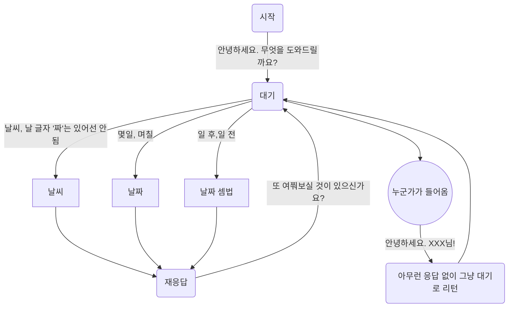

```mermaid
flowchart TD

start(시작)

weather[날씨]
day[날짜]
day_cal[날짜 셈법]

waiting(대기)
waiting2(재응답)
start-->|안녕하세요. 무엇을 도와드릴까요?|waiting

waiting-->|날씨, 날 글자 '짜'는 있어선 안됨 |weather
waiting-->|몇일, 며칠|day
waiting-->|일 후,일 전|day_cal

weather-->waiting2
day-->waiting2
day_cal-->waiting2

waiting2-->|또 여쭤보실 것이 있으신가요?|waiting


waiting-->someone_enter(("누군가가 들어옴"))
someone_enter-->|안녕하세요. XXX님!|just_returned(아무런 응답 없이 그냥 대기로 리턴)
just_returned-->waiting
```

