---
# 03-1 브랜치란?


모든 버전 관리 시스템에서는 '브랜치(Branch)'라는 개념이 있다. 브랜치는 원래 나뭇가지라는 뜻이다. 버전 관리 시스템에서는 나뭇가지에서 새 줄기를 뻗듯이 여러 갈래로 퍼지는 데이터 흐름을 가지는 말로 사용한다. 이제부터 브랜치가 정확히 무엇이고, 깃에서는 어떻게 브랜치를 만들고 사용하지 알아보겠다.


### 브랜치가 필요한 이유


우리가 어떤 제품의 사용 설명서를 만든다고 생각해 볼 때, 사용 설명서의 버전 관리는 깃으로 하고, 제품 출시 전에는 다음 그림처럼 개발 순서에 따라 사용 설명서를 작성하면 된다. 하지만 제품이 출시되고 나면 문제가 생간다. 고객사마다 추가로 요구하는 내용이 다른 것이고, 요구 사항을 반영하다 보면 고객사에 따라 제품이 달라질 것이고, 이에 맞춰 사용 설명서도 달라져야 한다.


### 브랜치 기능 살펴보기

브랜치는 어떻게 저 복잡한 문제를 간단하게 해결할까? 이를 알아보기 위해 먼저 브랜치 기능이 어떻게 작동하는지 살펴보겠다.
깃으로 버전 관리를 시작하면 master라는 브랜치가 만들어진다. 사용자가 커밋할 때마다 master 브랜치는 최신 커밋을 가리킨다. 즉, 브랜치는 커밋을 가리키는 포인터와 비슷하다고 생각하면 된다. 새 브랜치를 만들면 어떻게 될까? 새 브랜치를 만들면 기존에 저장한 파일을 master 브랜치에 그대로 유지하면서 기존 파일 내용을 수정하거나 새로운 기능을 구현할 파일을 만들 수 있다. 이렇게 master 브랜치에서 뻗어 나오는 새 브랜치를 만드는 것을 '분기(branch)한다'고 한다.

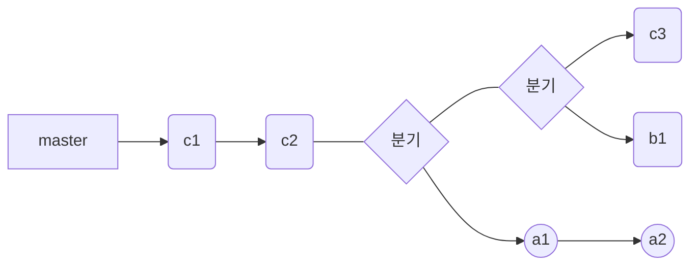


새 브랜치에서 원하는 작업을 다 끝냈다면 새 브랜치에  있던 파일을 master 브랜치에 합칠 수 있다. 이렇게 분기했던 브랜치를 msater 브랜치에 합치는 것을 '병합(merge)한다' 고 한다.


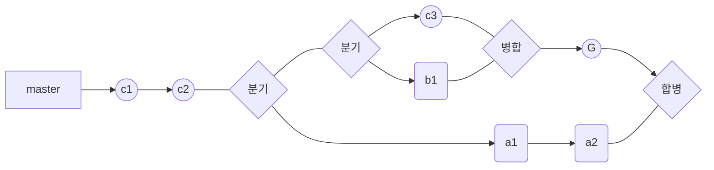


깃과 관련된 문서나 책을 보다 보면 위와 같은 그림들을 볼 수 있다. 이 그림들이 바로 브랜치의 분기와 병합을 간략하게 나타낸 것이다.


---
# 03-2 브랜치 만들기


앞에서 여러 고객사에게 다른 버전의 사용 설명서를 제공해야 할 때 발생하는 문자를 브랜치를 사용하면 해결할 수 있다고 했다. 이제부터 어떻게 문제를 해결해야 하는지 직접 여러 브랜치를 만들면서 알아보겠다.


### 실습 상황 설정하기


먼저 상황을 설정해 보겠다. 먼저 디렉터리를 만들고 그 안에 사용 설명서라고 생각하고 텍스트 파일을 하나 만들어 보겠다.


1. 터미널 창을 열어 홈 디렉터리에 manual 이라는 새 디렉터리를 만들고 해당 디렉터리로 이동한다.
``` shell
kgm09@kim_gyeong_min MINGW64 ~/Documents
$ mkdir manual

kgm09@kim_gyeong_min MINGW64 ~/Documents
$ cd manual

```


2. manual 디렉터리를 저장소로 만들고 ls -al 명령을 사용해서 .git 디렉터리가 만들어졌는지 확인해 보라.

``` shell
kgm09@kim_gyeong_min MINGW64 ~/Documents/manual
$ git init
Initialized empty Git repository in C:/Users/kgm09/Documents/manual/.git/

kgm09@kim_gyeong_min MINGW64 ~/Documents/manual (master)
$ ls -al
total 12
drwxr-xr-x 1 kgm09 197609 0 Mar 10 11:01 ./
drwxr-xr-x 1 kgm09 197609 0 Mar 10 11:00 ../
drwxr-xr-x 1 kgm09 197609 0 Mar 10 11:01 .git/

```


3. manual 디렉터리 안에 work.txt 파일을 만들어 보겠다. 커맨드 라인에 다음과 같이 입력해서 입을 연다.

``` shell
kgm09@kim_gyeong_min MINGW64 ~/Documents/manual (master)
$ vim work.txt


```


4. 빔이 열리면 키보드에서 '**I**'를 눌러 입력 모드로 바꾸고, 'content 1'이라는 내용을 입력한 다음 저장한다.
```
content 1
~
~
~
~
~
work.txt[+] [unix] (08:59 01/01/1970)                                    1,9 All
:wq
```


5. 방금 만든 work.txt 파일을 스테이지에 올리고 커밋한다. 커밋 메시지는 간단히 'work1'이라고 하겠다.

``` shell
kgm09@kim_gyeong_min MINGW64 ~/Documents/manual (master)
$ git add work.txt
warning: in the working copy of 'work.txt', LF will be replaced by CRLF the next time Git touches it

kgm09@kim_gyeong_min MINGW64 ~/Documents/manual (master)
$ git commit -m 'work 1'
[master (root-commit) ad8dedc] work 1
 1 file changed, 1 insertion(+)
 create mode 100644 work.txt

kgm09@kim_gyeong_min MINGW64 ~/Documents/manual (master)
$

```


6. 커밋이 완료되면 다음과 같이 입력해서 커밋 내역을 확인해 보라.

``` shell
kgm09@kim_gyeong_min MINGW64 ~/Documents/manual (master)
$ git log
commit ad8dedce1c7e33e1a467b539d654ecb2c3effbf4 (HEAD -> master)
Author: kgm0927 <initial929@gmail.com>
Date:   Sun Mar 10 11:12:29 2024 +0900

    work 1

kgm09@kim_gyeong_min MINGW64 ~/Documents/manual (master)
$

```


7. work.txt 파일을 두 번 더 커밋해 보겠다. 먼저 work.txt 파일에 'content2'를 추가한 후 'work2'라는 메시지와 함께 커밋한다.

``` shell
kgm09@kim_gyeong_min MINGW64 ~/Documents/manual (master)
$ vim work.txt

kgm09@kim_gyeong_min MINGW64 ~/Documents/manual (master)
$ git commit -am "work 2"
warning: in the working copy of 'work.txt', LF will be replaced by CRLF the next time Git touches it
[master 37b2fb4] work 2
 1 file changed, 2 insertions(+), 1 deletion(-)

kgm09@kim_gyeong_min MINGW64 ~/Documents/manual (master)
$

```


8. 그리고 work.txt 파일에 'content3'를 추가한 후 'work3'라는 메시지와 함께 커밋한다.

``` shell
kgm09@kim_gyeong_min MINGW64 ~/Documents/manual (master)
$ vim work.txt

kgm09@kim_gyeong_min MINGW64 ~/Documents/manual (master)
$ git commit -am "work 3"
warning: in the working copy of 'work.txt', LF will be replaced by CRLF the next time Git touches it
[master 41c6153] work 3
 1 file changed, 1 insertion(+)

kgm09@kim_gyeong_min MINGW64 ~/Documents/manual (master)
$

```

9. 커밋이 끝나면 'git log'를 입력해해서 커밋 내역을 확인해 보라. 커밋 메시지가 'work1','work2','work3'인 커밋들이 보일 것이다. master 브랜치가 가장 최신 커밋인 'work3'를 가리키고 잇고, HEAD가 master 브랜치를 가리키고 잇다. HEAD는 여러 브랜치 중에서 현재 작업 중인 브랜치를 가리킨다.

``` shell
kgm09@kim_gyeong_min MINGW64 ~/Documents/manual (master)
$ git log
commit 41c61533b096ba40ee66ce97041cbfaf017eb995 (HEAD -> master)
Author: kgm0927 <initial929@gmail.com>
Date:   Sun Mar 10 11:15:43 2024 +0900

    work 3

commit 37b2fb48cf05118c5c8fd044291083ba789ff074
Author: kgm0927 <initial929@gmail.com>
Date:   Sun Mar 10 11:14:37 2024 +0900

    work 2

commit ad8dedce1c7e33e1a467b539d654ecb2c3effbf4
Author: kgm0927 <initial929@gmail.com>
Date:   Sun Mar 10 11:12:29 2024 +0900

    work 1


```


여기까지가 초기 사용 설명서를 만드는 작업이었다고 가정하겠다. 이제부터 여러 고객사에게로 다른 내용의 사용 설명서를 제공해야 하는 상황이다. 브랜치를 사용하지 않는다면 각 고객사 디렉터리를 만들고 manual 디렉터리를 복사해서 사용해야 할 것이다. 곧 여러 문제가 발생할 것이기도 하다. 그러나 브랜치를 사용한다면 간단하게 처리할 수 있다.


### 새 브랜치 만들기


이제부터 직접 브랜치를 만들면서 위와 같은 문제를 어떻게 더 세련된 방법으로 처리하는지 알아보겠다. 여기에서는 apple, google, ms 라는 고객사가 있다고 가정해 본다.


1. 깃에서 브랜치를 만들거나 확인하는 명령은 git branch이다. 다음과 같이 입력해보라.

``` shell
kgm09@kim_gyeong_min MINGW64 ~/Documents/manual (master)
$ git branch

```


2. master라고 나타나지 않는가? master는 특별한 브랜치이다. 저장소를 만들 때 기본적으로 master 브랜치가 만들어진다. 우리는 그동안 master 브랜치에서 작업하고 있었던 것이다.

``` shell
kgm09@kim_gyeong_min MINGW64 ~/Documents/manual (master)
$ git branch
* master


```


3. 새로운 브랜치를 만들려면 git branch 명령 다음에 만들려는 브랜치 이름을 적는다. 고객사인 apple의 브랜치를 만들기 위해 다음과 같이 입력하라.

``` shell

kgm09@kim_gyeong_min MINGW64 ~/Documents/manual (master)
$ git branch apple

```

4. apple 브랜치가 만들어져도 화면에는 아무것도 나타나지 않는다. apple 브랜치가 제대로 만들여졌는가? 현재 저장소의 브랜치를 확인하기 위해 다음과 같이 입력해 보라.

> [! 중요한 점] git branch 명령은 브랜치를 만들거나 확인할 때 둘 다 사용한다.

``` shell
kgm09@kim_gyeong_min MINGW64 ~/Documents/manual (master)
$ git branch

```


5. master 브랜치 위에 apple 브랜치가 추가된 것을 확인할 수 있다. master 앞에 `*` 표시는 아직 우리가 master 브랜치에서 작업하고 있다는 뜻이다.

``` shell

kgm09@kim_gyeong_min MINGW64 ~/Documents/manual (master)
$ git branch
  apple
* master

```

6. 브랜치가 추가된 후에는 커밋 로그 화면도 다르게 나타난다. git log 명령을 사용해 커밋을 확인해 보라. 그동안 커밋 로그를 할 때(HEAD->master)라고 표시되던 곳에 apple 브랜치가 추가되면서 (HEAD->master,apple)로 바뀌어 있다. 이 표시는 저장소에 master, apple 2개의 브랜치가 있고, HEAD->master이므로 현재 작업 중인 브랜치는 master 브랜치라는 의미이다.

``` shell
kgm09@kim_gyeong_min MINGW64 ~/Documents/manual (master)
$ git log
commit 41c61533b096ba40ee66ce97041cbfaf017eb995 (HEAD -> master, apple)
Author: kgm0927 <initial929@gmail.com>
Date:   Sun Mar 10 11:15:43 2024 +0900

    work 3

commit 37b2fb48cf05118c5c8fd044291083ba789ff074
Author: kgm0927 <initial929@gmail.com>
Date:   Sun Mar 10 11:14:37 2024 +0900

    work 2

commit ad8dedce1c7e33e1a467b539d654ecb2c3effbf4
Author: kgm0927 <initial929@gmail.com>
Date:   Sun Mar 10 11:12:29 2024 +0900

    work 1

kgm09@kim_gyeong_min MINGW64 ~/Documents/manual (master)
$

```


7. 앞에서와 같은 방법으로 google 브랜치와 ms 브랜치를 만들어 보라. 그리고 git branch 명령으로 저장소 안에 있는 모든 브랜치를 확인해 보라.

``` shell

kgm09@kim_gyeong_min MINGW64 ~/Documents/manual (master)
$ git branch google

kgm09@kim_gyeong_min MINGW64 ~/Documents/manual (master)
$ git branch ms

kgm09@kim_gyeong_min MINGW64 ~/Documents/manual (master)
$ git branch
  apple
  google
* master
  ms

kgm09@kim_gyeong_min MINGW64 ~/Documents/manual (master)
$

```


### 브랜치 사이 이동하기 - git checkout

브랜치 여러 개 만들었으면 각 브랜치를 오가면서 작업할 수 있어야할 것이다. 브랜치 사이를 이동하는 법을 알아보겠다.


1. git log로 확인해 보면 master 브랜치를 비롯해 ms, google, apple 브랜치가 'work 3' 커밋 상태에서 만들어진 것을 알 수 있다. 즉 이것은 master 브랜치 뿐만 아니라 ms와 google, apple 브랜치에도 최신 커밋이 'work 3'라는 뜻이다.

```
kgm09@kim_gyeong_min MINGW64 ~/Documents/manual (master)
$ git log
commit 41c61533b096ba40ee66ce97041cbfaf017eb995 (HEAD -> master, ms, google, apple)
Author: kgm0927 <initial929@gmail.com>
Date:   Sun Mar 10 11:15:43 2024 +0900

    work 3

commit 37b2fb48cf05118c5c8fd044291083ba789ff074
Author: kgm0927 <initial929@gmail.com>
Date:   Sun Mar 10 11:14:37 2024 +0900

    work 2

commit ad8dedce1c7e33e1a467b539d654ecb2c3effbf4
Author: kgm0927 <initial929@gmail.com>
Date:   Sun Mar 10 11:12:29 2024 +0900

    work 1

kgm09@kim_gyeong_min MINGW64 ~/Documents/manual (master)
$

```


2. 현재 우리는 master 브랜치에 있다는 점 기억하고 있을 것이다. 커밋 하나를 만들어서 어떻게 달라지는지 확인해 보겠다. work.txt 파일 안에 'master content 4'라는 내용을 추가한 후 'master work 4'라는 메시지와 함께 커밋해 보겠다.

``` shell
kgm09@kim_gyeong_min MINGW64 ~/Documents/manual (master)
$ vim work.txt

kgm09@kim_gyeong_min MINGW64 ~/Documents/manual (master)
$ git commit -am "master content 4"
warning: in the working copy of 'work.txt', LF will be replaced by CRLF the next time Git touches it
[master 8cd58c8] master content 4
 1 file changed, 1 insertion(+)

kgm09@kim_gyeong_min MINGW64 ~/Documents/manual (master)
$

```


3. master 브랜치에 새로운 커밋이 추가되었는데 로그가 어떻게 바뀌었을까? git log 명령에 --oneline 옵션을 추가해서 확인해 보자. --oneline 옵션은 한 줄에 한 커밋씩 나타내 주기 때문에 커밋을 간단히 확인할 때 편리하다.

```shell

kgm09@kim_gyeong_min MINGW64 ~/Documents/manual (master)
$ git log --oneline


```

4. 최신 커밋인 'master work 4'는 master 브랜치에만 적용되어 있다. ms와 google, apple 브랜치는 아직 'work 3' 커밋 상태이다.

``` shell

kgm09@kim_gyeong_min MINGW64 ~/Documents/manual (master)
$ git log --oneline
8cd58c8 (HEAD -> master) master content 4
41c6153 (ms, google, apple) work 3
37b2fb4 work 2
ad8dedc work 1


```


5. 현재 브랜치(master)에서 다른 브랜치로 이동하면 어떻게 변하는지를 살펴보겠다. 다른 브랜치로 이동하려면 git checkout 명령 다음에 브랜치 이름을 사용한다. **==그래서 apple 브랜치로 이동하는 것을 'apple 브랜치로 체크아웃한다.'고 말한다.==** 다음과 같이 입력해서 apple 브랜치로 체크아웃한다.

``` shell
kgm09@kim_gyeong_min MINGW64 ~/Documents/manual (master)
$ git checkout apple

```


6. $ 위에 나타난 파일 경로 끝에 (apple)이라고 표시될 것이다. 현재 브랜치가 apple이라는 뜻이다.

``` shell
kgm09@kim_gyeong_min MINGW64 ~/Documents/manual (master)
$ git checkout apple
Switched to branch 'apple'

```


7. 작업 브랜치를 apple 브랜치로 바꿨을 때 어떤 변화가 생기는지를 확인해 본다. git log 명령을 사용해서 현재 브랜치의 커밋 로그를 확인해 본다.

``` shell
kgm09@kim_gyeong_min MINGW64 ~/Documents/manual (apple)
$ git log --oneline

```


8.  master 브랜치에서 apple 브랜치를 분기하기 전까지 master 브랜치에 있던 커밋들은 그대로 apple 브랜치에 복사된 것을 확인할 수 있다. 그리고 최신 커밋 해시에서 HEAD가 apple을 가리키고 있다.

```shell
kgm09@kim_gyeong_min MINGW64 ~/Documents/manual (apple)
$ git log --oneline
41c6153 (HEAD -> apple, ms, google) work 3
37b2fb4 work 2
ad8dedc work 1

```


즉 apple 브랜치의 최신 커밋은 처음 분기될 때인 'work 3' 커밋 그대로이다. 그렇다면 work.txt 파일에는 무엇이 있을까? cat 명령을 사용해 work.txt 파일의 내용을 확인해 보자.


``` shell
kgm09@kim_gyeong_min MINGW64 ~/Documents/manual (apple)
$ cat work.txt

```


9. 최신 커밋이 work 3 이기 때문에 content1부터 content3까지 세 개의 행만 있을 것이다. master 브랜치에서 입력했던 'master content 4'가 없지 않는가? 이를 통해 apple 브랜치가 master 브랜치에서 분기된 이후에 master 브랜치에 추가된 커밋은 apple 커밋에 영향을 미치지 않았다는 것을 알 수 있다.

``` shell
kgm09@kim_gyeong_min MINGW64 ~/Documents/manual (apple)
$ cat work.txt
content 1
content 2
content 3

```


---

# 03-3 브랜치 정보 확인하기


여기에서는 여러 브랜치에서 각각 커밋이 이루어질 때 커밋까리 어떤 관계를 하고 있는지 확인하는 방법과 브랜치 사이의 차이점을 확인하는 방법을 알아보겠다.


### 새 브랜치에서 커밋하기

apple 브랜치에 새로운 커밋을 만들어 보겠다. 앞의 실습을 잘 따라왔다면 현재 apple 브랜치로 체크아웃한 상태일 것이다. 


1. apple 브랜치에는 work.txt 파일이 있다. 빔에서 이 파일을 열고 'apple content 4'라는 텍스트를 추가하고 저장한다.

``` shell
kgm09@kim_gyeong_min MINGW64 ~/Documents/manual (apple)
$ vim work.txt


content 1
content 2
content 3
content 4
~
~
~
~
~
~
~
~
~
~
work.txt [dos] (12:31 10/03/2024)                                                               4,9 All
"work.txt" [dos] 4L, 44B


```

2. 실제 업무에서는 apple 고객사만을 위한 내용이 담긴 파일도 필요할 것이다. apple.txt라는 새로운 파일도 만든다. 빔에서 apple.txt 문서를 만들고 여기에도 똑같이 'apple content 4'라는 텍스트를 입력하고 저장한다.
```shell
kgm09@kim_gyeong_min MINGW64 ~/Documents/manual (apple)
$ vim apple.txt

apple content 4
~
~
~
~
~
~
~
~
~
~
apple.txt [unix] (13:04 10/03/2024)                                                            1,15 All
"apple.txt" [unix] 1L, 16B


```

3. 수정된 2개의 파일을 각각 스테이지에 올릴 수 도 있지만 git add 뒤에 마침표(.)를 추가하면 현재 저장소에서 수정된 파일을 한꺼번에 스테이지에 올릴 수 있다. 다음 명령을 실행하라. 그리고 'apple  content 4'라는 메시지와 함께 커밋한다.

``` shell
kgm09@kim_gyeong_min MINGW64 ~/Documents/manual (apple)
$ git add .
warning: in the working copy of 'apple.txt', LF will be replaced by CRLF the next time Git touches it

kgm09@kim_gyeong_min MINGW64 ~/Documents/manual (apple)
$ git commit -m "apple content 4"
[apple e5e2450] apple content 4
 2 files changed, 2 insertions(+)
 create mode 100644 apple.txt

kgm09@kim_gyeong_min MINGW64 ~/Documents/manual (apple)
$

```


4. 커밋이 어떻게 저장되는지 git log 명령을 확인해보라.

``` shell
kgm09@kim_gyeong_min MINGW64 ~/Documents/manual (apple)
$ git log --oneline

```

5. 첫 번째 줄에 (HEAD -> apple)이라고 되어 있으니 현재 apple 브랜치에 체크아웃한 상태이고, apple 브랜치의 최신 커밋은 'apple content4'이다.

``` shell
kgm09@kim_gyeong_min MINGW64 ~/Documents/manual (apple)
$ git log --oneline
e5e2450 (HEAD -> apple) apple content 4
41c6153 (ms, google) work 3
37b2fb4 work 2
ad8dedc work 1


```


6. git log 명령을 사용할 때 다음과 같이 --branches 옵션을 사용하면 각 브랜치의 커밋을 함께 볼 수 있다.
```shell
kgm09@kim_gyeong_min MINGW64 ~/Documents/manual (apple)
$ git log --oneline --branches

```


7. 결과 화면을 보면 커밋 해시마다 오른쪽에(HEAD -> apple), (master), (ms,google)이라고 되어 있다. 이 부분을 보고 어떤 브랜치에서 만든 커밋인지 구별할 수 있다. 즉 master 브랜치의 최신 커밋은 'master content 4'이고, ms 브랜치와 google 브랜치의 최신 커밋은 'work3'이다.

```shell

kgm09@kim_gyeong_min MINGW64 ~/Documents/manual (apple)
$ git log --oneline --branches
e5e2450 (HEAD -> apple) apple content 4
8cd58c8 (master) master content 4
41c6153 (ms, google) work 3
37b2fb4 work 2
ad8dedc work 1

kgm09@kim_gyeong_min MINGW64 ~/Documents/manual (apple)
$

```


8. 브랜치의 커밋의 관계를 좀 더 쉽게 보기 위해 그래프 형태로 표시하려면 git log 명령에 --graph 옵션을 함께 사용한다.

```  shell
kgm09@kim_gyeong_min MINGW64 ~/Documents/manual (apple)
$ git log --oneline --branches --graph
* e5e2450 (HEAD -> apple) apple content 4
| * 8cd58c8 (master) master content 4
|/
* 41c6153 (ms, google) work 3
* 37b2fb4 work 2
* ad8dedc work 1


```


9. 커밋 내역 왼쪽 수직선(|)이 보이는가? 이 점선이 커밋과 커밋의 관계를 보여주는 것이다. 그래프를 살펴보면 apple 브랜치의 최선 커밋은 'apple content4'인데, 점선을 따라 'apple content 4' 커밋의 부모를 찾아가 보면 'work 3' 커밋을 만나게 된다. 즉 apple 브랜치에서는 'work3' 커밋 다음에 'apple content 4'커밋이 만들어졌다는 뜻이다.

``` shell
kgm09@kim_gyeong_min MINGW64 ~/Documents/manual (apple)
$ git log --oneline --branches --graph
* e5e2450 (HEAD -> apple) apple content 4
| * 8cd58c8 (master) master content 4
|/
* 41c6153 (ms, google) work 3
* 37b2fb4 work 2
* ad8dedc work 1


```


10. master 브랜치도 살펴보면, master 브랜치의 최신 커밋은 'master content 4'이다. 그리 수직선을 따라가 부모 커밋을 'work 3' 커밋이다. apple 브랜치의 커밋과 amster 브랜치의 커밋이 같은 부모 커밋을 가지고 있다. 즉, master 브랜치나 apple 브랜치는 'work 3' 커밋까지는 같고 그 이후부터 브랜치마다 다른 커밋을 만들었다는 사실을 알 수 있다.

``` shell
kgm09@kim_gyeong_min MINGW64 ~/Documents/manual (apple)
$ git log --oneline --branches --graph
* e5e2450 (HEAD -> apple) apple content 4
| * 8cd58c8 (master) master content 4
|/
* 41c6153 (ms, google) work 3
* 37b2fb4 work 2
* ad8dedc work 1


```


### 브랜치 사이의 차이점 알아보기

브랜치마다 커밋이 점점 쌓여갈수록 브랜치 사이에 어떤 차이가 있는지 일일이 확인하기 어려워진다. 이럴 때는 브랜치 이름 사이에 마침표 두 개(..)를 넣는 명령으로 차이점을 쉽게 확인할 수 있다. 브랜치 이름과 마침표 사이에는 공백없이 입력하여, 마침표 왼쪽에 있는 브랜치를 기준으로 오른쪽 브랜치와 비교한다. ==**예를 들어 master 브랜치와 apple 브랜치 사이의 차이점이 무엇인지 확인하려면 다음과 같이 입력한다.**==


``` shell
kgm09@kim_gyeong_min MINGW64 ~/Documents/manual (apple)
$ git log master ..apple
commit 8cd58c899026724cbbdd47b9e9650ef34cf413f8 (master)
Author: kgm0927 <initial929@gmail.com>
Date:   Sun Mar 10 12:18:39 2024 +0900

    master content 4

```

이렇게 하면 master 브랜치에는 없고 apple 브랜치에만 있는 커밋, 즉 'apple content 4' 커밋을 보여준다.


반대로 apple 브랜치를 기준으로 master와 비교하면 apple 브랜치에는 없고 master 브랜치에만 있는 'master content 4' 커밋을 보여준다.


``` shell
kgm09@kim_gyeong_min MINGW64 ~/Documents/manual (apple)
$ git log apple..master
commit 8cd58c899026724cbbdd47b9e9650ef34cf413f8 (master)
Author: kgm0927 <initial929@gmail.com>
Date:   Sun Mar 10 12:18:39 2024 +0900

    master content 4

kgm09@kim_gyeong_min MINGW64 ~/Documents/manual (apple)
$

```


---
# 03-4 브랜치 병합하기기


만들어진 각 브랜치에서 작업을 하다가 어느 시점에서는 브랜치 작업을 마무리하고 기존 브랜치와 합쳐야 한다. 이것을 '브랜치 병합(merge)'이라고 한다. 브랜치와 브랜치를 병합하다 보면 여러 상황이 생길 수 잇는데 각 상황마다 병합하는 방법을 알아보겠다. 그리고 병합하면서 브랜치 사이에 충돌이 있을 대 해결하는 방법도 함께 살펴볼 것이다.


### 서로 다른 파일 병합하기

브랜치의 병합은 처음에 공부하기 까다롭기 때문에 새로운 저장소를 만들어서 필요한 브랜치와 커밋만 사용해 연습해 보겠다.


1. 터미널 창을 열고 홈 디렉터리로 이동한다. manual-2라는 깃 저장소를 만들텐데, git init 다음에 디렉터리 이름을 입력하면 새로운 디렉터리를 만들고 초기화하는 과정을 한꺼번에 처리할 수 있다. manual-2 디렉터리로 이동한 후 ls -al 명령을 이용하면 .git/ 디렉터리가 만들어진 것을 확인할 수 있다.

``` shell
kgm09@kim_gyeong_min MINGW64 ~/Documents
$ git init manual-2
Initialized empty Git repository in C:/Users/kgm09/Documents/manual-2/.git/

kgm09@kim_gyeong_min MINGW64 ~/Documents
$ cd manual-2

kgm09@kim_gyeong_min MINGW64 ~/Documents/manual-2 (master)
$ ls -al
total 12
drwxr-xr-x 1 kgm09 197609 0 Mar 10 13:34 ./
drwxr-xr-x 1 kgm09 197609 0 Mar 10 13:34 ../
drwxr-xr-x 1 kgm09 197609 0 Mar 10 13:34 .git/

kgm09@kim_gyeong_min MINGW64 ~/Documents/manual-2 (master)
$

```

2. 빔에서 work.txt 파일을 만들고 '1'이라는 내용을 입력한 후 저장하라. 그리고 'work 1'이라는 커밋 메시지와 함께 커밋한다.

``` shell

kgm09@kim_gyeong_min MINGW64 ~/Documents/manual-2 (master)
$ vim work.txt

kgm09@kim_gyeong_min MINGW64 ~/Documents/manual-2 (master)
$ git add work.txt
warning: in the working copy of 'work.txt', LF will be replaced by CRLF the next time Git touches it

kgm09@kim_gyeong_min MINGW64 ~/Documents/manual-2 (master)
$ git commit -m "work 1"
[master (root-commit) 02d85cc] work 1
 1 file changed, 1 insertion(+)
 create mode 100644 work.txt

kgm09@kim_gyeong_min MINGW64 ~/Documents/manual-2 (master)
$

```


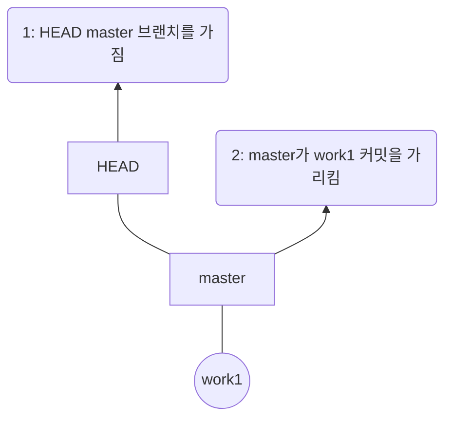


3. 이제 'o2'라는 브랜치를 만들어 보겠다.

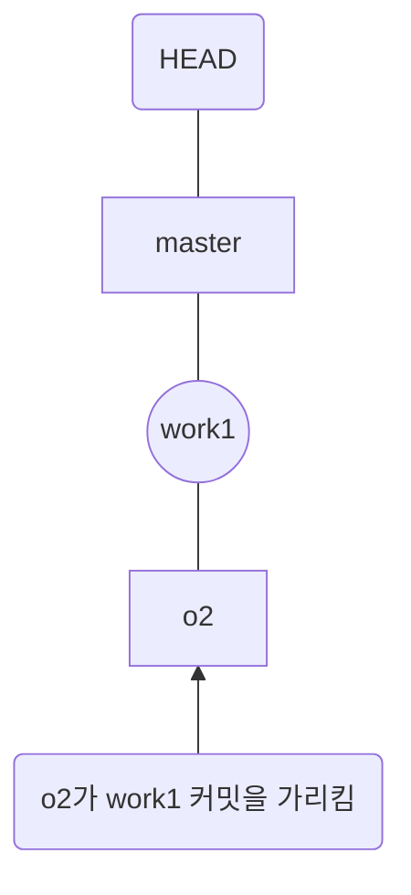


4. 현재 master 브랜치에 master.txt 라는 파일을 하나 더 만들겠다. 빔에서 'master 2'라는 내용을 입력하고 저장한다. 그리고 'master work 2'라는 메시지와 함께 커밋한다.

``` shell
kgm09@kim_gyeong_min MINGW64 ~/Documents/manual-2 (master)
$ vim master.txt


master 2
~
~
~
~
~
~
~
~
~
~
~
~
master.txt[+] [unix] (08:59 01/01/1970)                                                         1,7 All
:wq


kgm09@kim_gyeong_min MINGW64 ~/Documents/manual-2 (master)
$ git add master.txt
warning: in the working copy of 'master.txt', LF will be replaced by CRLF the next time Git touches it

kgm09@kim_gyeong_min MINGW64 ~/Documents/manual-2 (master)
$ git commit -m "master work 2"
[master 3d8288b] master work 2
 1 file changed, 1 insertion(+)
 create mode 100644 master.txt

kgm09@kim_gyeong_min MINGW64 ~/Documents/manual-2 (master)
$

```

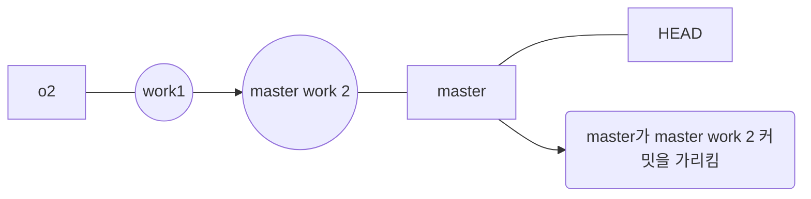


5. 이제 o2 브랜치로 체크아웃한다.

``` shell
kgm09@kim_gyeong_min MINGW64 ~/Documents/manual-2 (master)
$ git checkout o2
Switched to branch 'o2'

```


6. o2 브랜치에서 o2.txt라는 파일을 만들고 'o2 2'라는 내용을 저장한다. o2.txt는 'o2 work 2'라는 메시지와 함께 커밋하라.

``` shell

kgm09@kim_gyeong_min MINGW64 ~/Documents/manual-2 (o2)
$ vim o2.txt

kgm09@kim_gyeong_min MINGW64 ~/Documents/manual-2 (o2)
$ git add o2.txt
warning: in the working copy of 'o2.txt', LF will be replaced by CRLF the next time Git touches it

kgm09@kim_gyeong_min MINGW64 ~/Documents/manual-2 (o2)
$ git commit -m ""o2 work 2"
> ^C

kgm09@kim_gyeong_min MINGW64 ~/Documents/manual-2 (o2)
$ git commit -m "o2 work 2"
[o2 d3692d1] o2 work 2
 1 file changed, 1 insertion(+)
 create mode 100644 o2.txt

kgm09@kim_gyeong_min MINGW64 ~/Documents/manual-2 (o2)
$

```


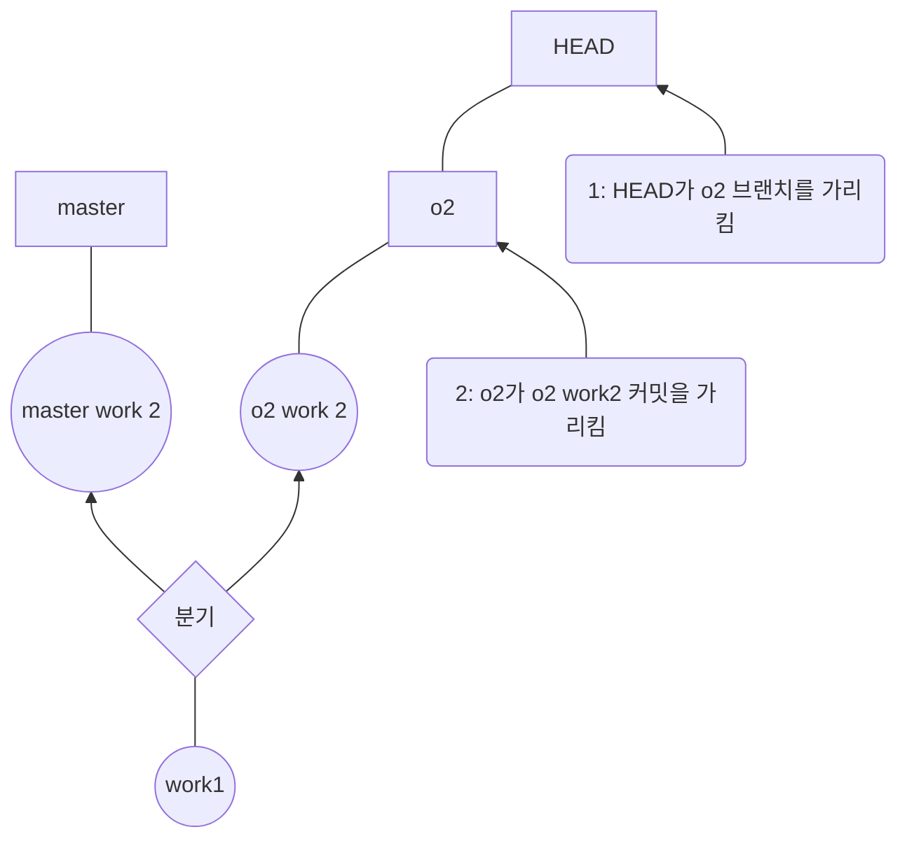


7. git log 명령을 사용해서 현재 커밋의 상태를 확인해 보아라. 커밋 'work 1'은 master 브래치와 o2 브랜치가 똑같이 가지고 있다. 그 다음으로 master 브랜치에는 **'master work 2'** 커밋이 생겼고 o2 브랜치에는 **'o2 work 2'** 커밋이 생겼다.


``` shell
kgm09@kim_gyeong_min MINGW64 ~/Documents/manual-2 (o2)
$ git log --oneline --branches --graph
* d3692d1 (HEAD -> o2) o2 work 2
| * 3d8288b (master) master work 2
|/
* 02d85cc work 1

kgm09@kim_gyeong_min MINGW64 ~/Documents/manual-2 (o2)
$

```

8. o2 브랜치에서 작업이 다 끝났다고 가정하고, o2 브랜치의 내용을 master 브랜치로 병합해 보겠다. 브랜치를 병합하려면 먼저 master 브랜치로 체크아웃해야 한다.

```shell

kgm09@kim_gyeong_min MINGW64 ~/Documents/manual-2 (o2)
$ git checkout master
Switched to branch 'master'


```
9. 브랜치를 병합하려면 git merge 명령 뒤에 가져올 브랜치 이름을 적는다. master 브랜치 o2 브랜치를 가져와 병합하려면 다음과 같이 입력한다.
``` shell

kgm09@kim_gyeong_min MINGW64 ~/Documents/manual-2 (master)
$ git merge o2
Merge made by the 'ort' strategy.
 o2.txt | 1 +
 1 file changed, 1 insertion(+)
 create mode 100644 o2.txt


```


11. 자동으로 빔이 발생되면서 'Merge branch o2'라는 커밋 메시지가 나타난다. 브랜치를 병합하면서 만들어지는 커밋의 메시지이다. 커밋 메시지를 수정할 수도 있고, 자동 메시지를 그대로 사용해도 된다. Esc를 누르고 ':wq'를 입력해 내용을 저장한 후 편집기를 종료한다.

``` shell
Merge branch 'o2'
# Please enter a commit message to explain why this merge is necessary,
# especially if it merges an updated upstream into a topic branch.
#
# Lines starting with '#' will be ignored, and an empty message aborts
# the commit.
~
~
~
~
~
~
~
~
~
~
.git/MERGE_MSG [unix] (14:16 10/03/2024)                                                        1,1 All
"~/Documents/manual-2/.git/MERGE_MSG" [unix] 6L, 244B
```


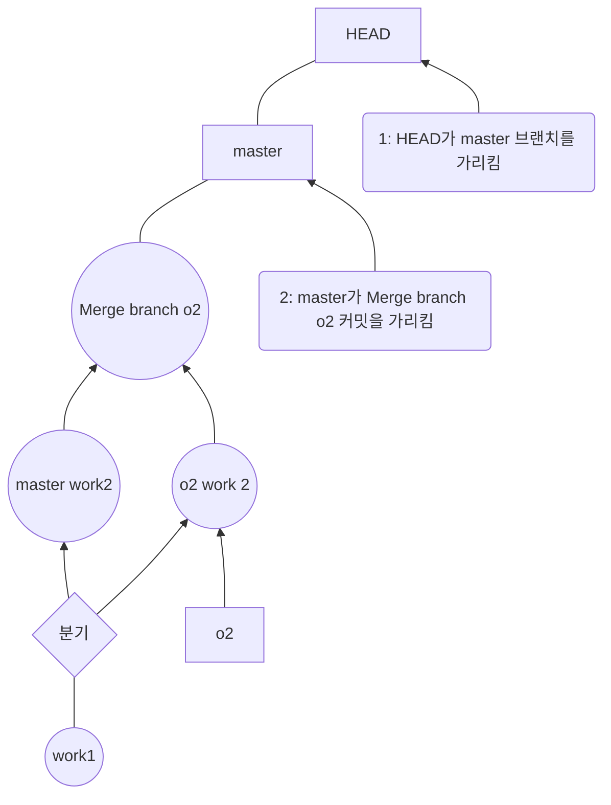


11. ls -al 명령을 확인해 보면 o2 브랜치에 있던 o2.txt 파일이 master 브랜치에 합쳐졌을 거것이다.

``` shell
kgm09@kim_gyeong_min MINGW64 ~/Documents/manual-2 (master)
$ ls -al
total 19
drwxr-xr-x 1 kgm09 197609  0 Mar 10 14:16 ./
drwxr-xr-x 1 kgm09 197609  0 Mar 10 13:34 ../
drwxr-xr-x 1 kgm09 197609  0 Mar 10 14:17 .git/
-rw-r--r-- 1 kgm09 197609 10 Mar 10 14:14 master.txt
-rw-r--r-- 1 kgm09 197609  6 Mar 10 14:16 o2.txt
-rw-r--r-- 1 kgm09 197609  2 Mar 10 13:35 work.txt

```


12.  git log --oneline --branches --graph 명령을 브랜치와 커밋들이 어떻게 병합되었는지 확인할 수도 있다. 'o2 work 2' 커밋이 master 브랜치에 병합되면서  'Merge branch o2'라는 커밋이 새로 생겼다. 두 브랜치에서 서로 다른 파일을 병합하는 경우 이렇게 간단히 해결할 수 있다.

``` shell
kgm09@kim_gyeong_min MINGW64 ~/Documents/manual-2 (master)
$ git log --oneline --branches --graph
*   b9a2d54 (HEAD -> master) Merge branch 'o2'
|\
| * d3692d1 (o2) o2 work 2
* | 3d8288b master work 2
|/
* 02d85cc work 1

kgm09@kim_gyeong_min MINGW64 ~/Documents/manual-2 (master)
$

```


---

- **한 걸음 더!: 빨리 감기 병합**

master 브랜치에서 브랜치를 분기한 후에 master 브랜치에 아무 변화가 없다면(새로운 커밋을 만들지 않았다면) 분기한 브랜치를 병합하는 것은 간단하다. 분기한 브랜치에서 만든 최신 커밋을 master 브랜치가 가리키게만 하면 되기 때문이다. 이 경우에는 화면에 커밋 해시가 업데이트되었다는 내용과 함께 fast-forward라는 메시지가 나타난다. 이런 병합을 빨리 감기 병합(fast-foreword merge)라고 부른다. git merge 명령의 결과가 단순히 포인터를 움직인 것이기 때문에 따로 커밋 메시지 창은 열리지 않는다.

---
- **한 걸음 더!: 브랜치를 병합할 때 편집기 창이 열리지 않게 하려면**

앞에서 브랜치를 병합할 때 자동으로 편집기가 실행되면서 커밋 메시지를 추가 작성할 수 있다 . 만약 편집기 창을 열지 않고 깃에서 지정하는 커밋 메시지를 그대로 사용하겠다면 다음과 같이 --no-edit 옵션을 추가한다.

```
$ git merge o2 --no-edit
```

브랜치를 병합할 때 편집기 창이 나타나지 않도록 설정한 후, 커밋 메시지를 추가하거나 수정하고 싶다면 병합 명령에 --edit 옵션을 사용한다.

```
$ git merge o2 --edit
```

---
### 같은 문서의 다른 위치를 수정했을 때 병합하기

master 브랜치와 o2 브래치에는 똑같이 work.txt 파일이 있다. 양쪽 브랜치에서 work.txt 문서를 수정하되 서로 다른 위치를 수정한 후 브랜치를 병합했을 때 어떤 결과가 나타나는지 확인해 보겠다.


1. 홈 디렉터리로 이동한 후 manaul-3라는 깃 저장소를 만들고, manual-3 디렉터리로 이동한다.

``` shell

kgm09@kim_gyeong_min MINGW64 ~/Documents
$ git init manual-3
Initialized empty Git repository in C:/Users/kgm09/Documents/manual-3/.git/

kgm09@kim_gyeong_min MINGW64 ~/Documents
$ cd manual-3

kgm09@kim_gyeong_min MINGW64 ~/Documents/manual-3 (master)
$

```


2. 빔에서 work.txt 파일을 만들고 다음과 같이 입력한다. 나중에 work.txt 문서를 수정하고 병합할 것이기 때문에 내용 사이의 두 줄의 공백을 두었다.

``` shell

# title
content


# title
content
~
~
~
~
~
~
work.txt[+] [unix] (08:59 01/01/1970)                                                         4,0-1 All
:wq

```

3. 방금 만든 work.txt를 스테이지에 올리고 커밋한다. 커밋 메시지는 'work 1'이라고 하겠다.
``` shell

kgm09@kim_gyeong_min MINGW64 ~/Documents/manual-3 (master)
$ git add work.txt
warning: in the working copy of 'work.txt', LF will be replaced by CRLF the next time Git touches it

kgm09@kim_gyeong_min MINGW64 ~/Documents/manual-3 (master)
$ git commit -m "work 1"
[master (root-commit) 08a0891] work 1
 1 file changed, 6 insertions(+)
 create mode 100644 work.txt

kgm09@kim_gyeong_min MINGW64 ~/Documents/manual-3 (master)
$

```

4. 'work1'이라는 커밋을 만들었으므로 o2라는 새로운 브랜치를 만들어 보겠다. 이제 master 브랜치와 o2 브랜치 모두 'work1' 커밋이 있게 된다.

``` shell
kgm09@kim_gyeong_min MINGW64 ~/Documents/manual-3 (master)
$ git branch o2


```

5. 양쪽 브랜치 모두에 있는 work.txt를 먼저 master 브랜치에서 수정하겠다.
``` shell
kgm09@kim_gyeong_min MINGW64 ~/Documents/manual-3 (master)
$ vim work.txt

```


6. work.txt 문서에는 '#title'과 'content'가 2개씩 있다. 그 중에서 첫 번째 'content' 다음 줄에 'master content'라고 입력한 후 저장한다.

``` shell
# title
content
master content 2

# title
content
~
~
~
~
~
~
~
```

7. 수정한 work.txt를 커밋해라. 커밋 메시지는 'master work2'라고 하겠다.

``` shell

kgm09@kim_gyeong_min MINGW64 ~/Documents/manual-3 (master)
$ git commit -am "master work 2"
warning: in the working copy of 'work.txt', LF will be replaced by CRLF the next time Git touches it
[master 7947fcf] master work 2
 1 file changed, 1 insertion(+), 1 deletion(-)


```


8. 이제 o2 브랜치의 work.txt 파일도 수정해 보겠다. 먼저 o2 브랜치로 체크아웃하고 work.txt 파일을 불러온다.

``` shell

kgm09@kim_gyeong_min MINGW64 ~/Documents/manual-3 (master)
$ git checkout o2
Switched to branch 'o2'
vi
kgm09@kim_gyeong_min MINGW64 ~/Documents/manual-3 (o2)
$ vim work.txt
```


9. 이번에는 두 번째 'content' 다음 줄에 'o2 content 2'라고 입력하고 저장한다.

```

# title
content


# title
content
o2 content 2
~
~
~
```

10. 수정한 work.txt 파일을 커밋해 보라. 커밋 메시지는 'o2 work 2'라고 하겠다.

``` shell
kgm09@kim_gyeong_min MINGW64 ~/Documents/manual-3 (o2)
$ vim work.txt

kgm09@kim_gyeong_min MINGW64 ~/Documents/manual-3 (o2)
$ git commit -am "o2 work 2"
[o2 5b2a628] o2 work 2
 1 file changed, 1 insertion(+)

kgm09@kim_gyeong_min MINGW64 ~/Documents/manual-3 (o2)
$

```


11. master 브랜치와 o2 브랜치 양쪽에서 work.txt 파일을 수정했지만 문서 안의 수정 위치는 다르다. 이럴 경우 어떻게 해야 할까? o2 브랜치를 master 브랜치에 합치기 위해 master 브랜치로 체크아웃한다.

``` shell
kgm09@kim_gyeong_min MINGW64 ~/Documents/manual-3 (o2)
$ git checkout master
Switched to branch 'master'

```

12. git merge 명령을 사용해 o2 브랜치를 master 브랜치로 끌어온다.

``` shell
kgm09@kim_gyeong_min MINGW64 ~/Documents/manual-3 (master)
$ git merge o2
Auto-merging work.txt
Merge made by the 'ort' strategy.
 work.txt | 1 +
 1 file changed, 1 insertion(+)
```

13. 자동으로 빔이 실행되면서 커밋 메시지가 나타날 것이다. 메시지를 수정할 수도 있고 그대로 사용할 수도 있다. 원하는 메시지를 사용한 다음 Esc를 누르고 :wq를 입력해 문서를 저장하고 편집기를 종료한다.
``` shell
Merge branch 'o2'
# Please enter a commit message to explain why this merge is necessary,
# especially if it merges an updated upstream into a topic branch.
#
# Lines starting with '#' will be ignored, and an empty message aborts
# the commit.
~
~
~
~
~
~
~
~
~
.git/MERGE_MSG [unix] (15:04 10/03/2024)                                                        1,1 All
"~/Documents/manual-3/.git/MERGE_MSG" [unix] 6L, 244B

```


14. 터미널 창에는 'Auto-merging work.txt'로 시작하는 병합 완료 메시지가 나타난다. o2 브랜치의 work.txt가 master 브랜치의 work.txt와 어떻게 병합되었을까? cat 명령을 사용해 work.txt 파일을 확인해 보라.

``` shell
kgm09@kim_gyeong_min MINGW64 ~/Documents/manual-3 (master)
$ cat work.txt

```

15. master 브랜치의 수정 내용과 o2 브랜치의 수정 내용이 자연스럽게 하나의 파일에 합쳐진 것을 볼 수 있다. 이렇게 브랜치를 자동으로 합쳐주는 기능이 있어 깃은 더욱 강력한 도구가 된다.

``` shell
kgm09@kim_gyeong_min MINGW64 ~/Documents/manual-3 (master)
$ cat work.txt
# title
content
master content 2

# title
content
o2 content 2

```


### 같은 문서의 위치를 수정했을 때 병합하기


깃에서 줄 단위로 변경 여부를 확인하다. 그래서 각 브랜치에 같은 파일 이름을 가지고 있으면서 같은 줄을 수정했을 때 브랜치를 병합하면 브랜치 충돌(conflict)이 발생한다. master 브랜치와 o2 브랜치에서 같은 파일의 위치를 수정한 후 병합해 보면서 어떤 경우에 브랜치 충돌이 생기는지, 그리고 어떻게 충돌을 해결하는지 알아보겠다.


1. 홈 디렉터리로 이동한 후 manual-4라는 깃 저장소를 만들고, manual-4 디렉터리로 이동한다.

``` shell
kgm09@kim_gyeong_min MINGW64 ~/Documents/manual-3 (master)
$ cd ..

kgm09@kim_gyeong_min MINGW64 ~/Documents
$ git init manual-4
Initialized empty Git repository in C:/Users/kgm09/Documents/manual-4/.git/

kgm09@kim_gyeong_min MINGW64 ~/Documents
$ cd manual-4

kgm09@kim_gyeong_min MINGW64 ~/Documents/manual-4 (master)
$

```


2. 빔에서 work.txt 파일을 만들고 다음과 같이 입력한다. 나중에 work.txt 문서의 같은 위치를 수정하기 위해 두 내용 사이에 빈 줄 하나만 두었다.

``` shell
# title
content

# title
content
~
~
~
~
~
~
~
~

```


3. 방금 만든 work.txt를 스테이지에 올리고 커밋한다. 커밋 메시지는 'work 1'이라고 하겠다.

``` shell
kgm09@kim_gyeong_min MINGW64 ~/Documents/manual-4 (master)
$ git add work.txt
warning: in the working copy of 'work.txt', LF will be replaced by CRLF the next time Git touches it

kgm09@kim_gyeong_min MINGW64 ~/Documents/manual-4 (master)
$ git commit -m "work 1"
[master (root-commit) 04a4818] work 1
 1 file changed, 5 insertions(+)
 create mode 100644 work.txt

kgm09@kim_gyeong_min MINGW64 ~/Documents/manual-4 (master)
$

```


4. 이제 o2라는 브랜치를 만든다. o2 브랜치는 만들어 지면서 master 브랜치 최근 커밋을 가져온다. 즉 브랜치 양쪽에 work.txt가 있다.

``` shell
kgm09@kim_gyeong_min MINGW64 ~/Documents/manual-4 (master)
$ git branch o2


```

5. 아직 체크아웃은 하지 않았으므로 현재 브랜치는 master 이다. 먼저 master 브랜치에서 work.txt를 수정한다.


6. work.txt 문서에는 '#title'과 'content'가 2개씩 있다. 그 중에서 첫 번째 'content' 다음 줄에 'master content 2'라고 입력한 후 저장한다.
``` shell
# title
content
master content 2
# title
content
~
~
~
~
~
~
~
~
~
~
~

```

7. 수정한 work.txt를 커밋하세요. 커밋 메시지는 'master work 2'라고 하겠다.
``` shell

kgm09@kim_gyeong_min MINGW64 ~/Documents/manual-4 (master)
$ git commit -am "master work 2"
warning: in the working copy of 'work.txt', LF will be replaced by CRLF the next time Git touches it
[master dbd225d] master work 2
 1 file changed, 1 insertion(+), 1 deletion(-)

kgm09@kim_gyeong_min MINGW64 ~/Documents/manual-4 (master)
$

```

8. 이제 o2 브랜치의 work.txt 파일도 수정해 보겠다. 먼저 o2 브랜치로 체크아웃한다. 그리고 work.txt 파일을 연다.

``` shell

kgm09@kim_gyeong_min MINGW64 ~/Documents/manual-4 (master)
$ git checkout o2
Switched to branch 'o2'

kgm09@kim_gyeong_min MINGW64 ~/Documents/manual-4 (o2)
$ vim work.txt

```

9. master 브랜치에 추가 내용을 입력했던 위치와 같은 곳에 'o2 content 2'라고 입력하고 저장한다.
``` shell
# title
content
o2 content 2
# title
content
~
~
~
~
~
~
~

```

10. 수정한 work.txt 파일을 커밋해 보라. 커밋 메시지는 'o2 work 2'라고 하겠다.
``` shell
kgm09@kim_gyeong_min MINGW64 ~/Documents/manual-4 (o2)
$ git commit -am "o2 work 2"
[o2 238758f] o2 work 2
 1 file changed, 1 insertion(+), 1 deletion(-)

kgm09@kim_gyeong_min MINGW64 ~/Documents/manual-4 (o2)
$

```

11. master 브랜치와 o2 브랜치 양쪽에서 work.txt 파일을 수정했지만 문서 안의 수정 위치가 같다. 이럴 경우 어떻게 병합할까? o2 브랜치를 master 브랜치에 병합하기 위해 먼저 master 브랜치로 체크아웃한다.

``` shell
kgm09@kim_gyeong_min MINGW64 ~/Documents/manual-4 (o2)
$ git checkout master
Switched to branch 'master'

```


12. git merge 명령을 사용해 o2 브랜치를 master 브랜치로 끌어온다.

``` shell
kgm09@kim_gyeong_min MINGW64 ~/Documents/manual-4 (master)
$ git merge o2

```


13. 이전에 git merge 명령을 실행했을 때처럼 자동으로 빔이 열리지 않고 메시지가 나타난다. 이 메시지는 work.txt를 자동병합하는 동안 충돌(conflict)이 발생했다는 뜻이다.

``` shell
kgm09@kim_gyeong_min MINGW64 ~/Documents/manual-4 (master)
$ git merge o2
Auto-merging work.txt
CONFLICT (content): Merge conflict in work.txt
Automatic merge failed; fix conflicts and then commit the result.

```


14. 충돌이 생긴 문서는 자동으로 병합될 수 없으므로 사용자가 직접 충돌 부분을 해결한 후 커밋해야 한다. 충돌이 생긴 work.txt는 어떻게 되어 있을까? 빔에서 work.txt를 열어보겠다.
``` shell
kgm09@kim_gyeong_min MINGW64 ~/Documents/manual-4 (master|MERGING)
$ vim work.txt


```

15. work.txt의 내용이 좀 특별하게 되어 있다. master 브랜치에 있는 내용과 o2 브랜치에 있던 내용이 한꺼번에 나타났기 때문이다. '<<<<<<< HEAD'와 가운데 가로줄(`=======`)사이의 내용은 현재 브랜치, 즉 master에서 수정한 내용이다. 가로줄(`=======`)과 '>>>>>>> o2'의 내용은 o2 브랜치에서 수정한 내용이다. 양쪽 브랜치의 내용을 참고하면서 직접 내용을 수정해야 한다.

``` shell
# title
content
<<<<<<< HEAD
master content 2
=======
o2 content 2
>>>>>>> o2
# title
content
~
~
~


```

16. 내용을 원하는 대로 수정했으면 문서에 나타나 있던 '<<<<<<<<HEAD'나 '>>>>>>>>o2', 가로줄(`=======`)은 삭제한다. 다 했으면 문서를 저장하고 편집기를 종료한다.

``` shell
# title
content

master content 2
o2 content 2

# title
content
~
~
~
~
~
~
~
~
```


17. 이제 수정한 work.txt를 스테이지에 올리고 커밋하면 된다. 커밋 메시지는 'merge o2 branch'로 하겠다. 이렇게 해서 o2 브랜치에서 병합한 work.txt의 충돌을 해결하고 커밋했다.

``` shell
kgm09@kim_gyeong_min MINGW64 ~/Documents/manual-4 (master|MERGING)
$ git commit -am "merge o2 branch"
[master f18792c] merge o2 branch

kgm09@kim_gyeong_min MINGW64 ~/Documents/manual-4 (master)
$

```

18. git log 명령에 --oneline과 --branches, --graph 옵션을 사용하면 지금까지 만든 브랜치와 커밋의 관계를 한눈에 확인할 수 있다.

``` shell

kgm09@kim_gyeong_min MINGW64 ~/Documents/manual-4 (master)
$ git log --oneline --branches --graph
*   f18792c (HEAD -> master) merge o2 branch
|\
| * 238758f (o2) o2 work 2
* | dbd225d master work 2
|/
* 04a4818 work 1

```


### 병합이 끝난 브랜치 삭제하기

브랜치 병합한 후 더 이상 사용하지 않는 브랜치는 깃에서 삭제할 수 있다. 단, 이렇게 브랜치를 삭제하더라도 이 브랜치가 완전히 지워지는 것이 아니라 다시 같은 이름의 브랜치를 만들면 예전 내용을 볼 수 있다.


1. git branch 명령을 사용하면 현재 저장소에 어떤 브랜치가 있는지 확인할 수 있다. 앞의 브랜치 병합 실습을 따라왔다면 현재 master 브랜치와 o2 브랜치가 있을 것이다.

``` shell
kgm09@kim_gyeong_min MINGW64 ~/Documents/manual-4 (master)
$ git branch
* master
  o2

kgm09@kim_gyeong_min MINGW64 ~/Documents/manual-4 (master)
$

```


2. 저장소의 기본 브랜치는 master 이므로 브랜치를 삭제하려면 master 브랜치에서 해야 한다. 현 브랜치가 master 브랜치가 아니라면 체크아웃하라.

``` shell

kgm09@kim_gyeong_min MINGW64 ~/Documents/manual-4 (master)
$ git checkout master
Already on 'master'

```


3. 브랜치를 삭제할 때는 git branch 명령에 -d 옵션을 사용한다. 다음과 같이 o2 브랜치를 삭제한다.

``` shell
kgm09@kim_gyeong_min MINGW64 ~/Documents/manual-4 (master)
$ git branch -d o2

```

> [!중요한 점]
> master 브랜치에 병합하지 않은 브랜치를 삭제하려면 오류 메시지가 나타난다. 이럴 경우 옵션 -d 대신 -D(대문자 D)를 사용해서 강제로 브랜치를 삭제할 수 있다.


4. 'Deleted branch o2'처럼 메시지가 나타나면 성공적으로 브랜치가 삭제된 것이다. 삭제한 브랜치는 같은 이름으로 다시 브랜치를 만들면 예전에 작업했던 내용이 그대로 나타난다. 즉, 브랜치를 삭제한다는 것은 완전히 저장소에서 없애는 것이 아니라 **==깃의 흐름 속에서 감추는 것==**이라고 생각하면 된다.

``` shell
kgm09@kim_gyeong_min MINGW64 ~/Documents/manual-4 (master)
$ git branch -d o2
Deleted branch o2 (was 238758f).


```


---

# 03-5 브랜치 관리하기

여기에서는 깃과 브랜치를 더 편하게 관리하기 위한 몇가지 명령을 살펴볼 계획이다. 하지만 아직 깃과 브랜치에 익숙하지 않는다면 이해가 어려울 수도 있다. 


### 브랜치에서 checkout과 reset의 작동 원리


02장에서 이미 checkout 명령과 reset 명령을 공부했다. 하지만 브랜치와 함께라면 더 다양하게 사용할 수 있다. 먼저 HEAD와 브랜치의 개념부터 간단히 알아본다. 그래야 checkout과 reset 명령을 더 잘 이해할 수 있다.


1. 홈 디렉터리로 이동한 후 test 라는 깃 저장소를 만들고, test 디렉터리로 이동한다.

``` shell

kgm09@kim_gyeong_min MINGW64 ~
$ cd Documents

kgm09@kim_gyeong_min MINGW64 ~/Documents
$ git init test
Initialized empty Git repository in C:/Users/kgm09/Documents/test/.git/

kgm09@kim_gyeong_min MINGW64 ~/Documents
$ cd test


```

5. 빔에서 c1.txt 파일을 만들고 숫자 '1'를 입력하고 저장한다. 여기에서는 내용이 중요한 것이 아니기 때문에 어떤 내용을 입력해도 된다. 그리고 방금 만든 c1.txt를 스테이지에  올리고 커밋한다. 커밋 메시지는 'c1'이라고 하겠다.

``` shell
kgm09@kim_gyeong_min MINGW64 ~/Documents/test (master)
$ vim c1.txt

kgm09@kim_gyeong_min MINGW64 ~/Documents/test (master)
$ git add c1.txt
warning: in the working copy of 'c1.txt', LF will be replaced by CRLF the next time Git touches it

kgm09@kim_gyeong_min MINGW64 ~/Documents/test (master)
$ git commit -m "c1"
[master (root-commit) 37d487d] c1
 1 file changed, 1 insertion(+)
 create mode 100644 c1.txt

kgm09@kim_gyeong_min MINGW64 ~/Documents/test (master)
$

```


3. git log 명령을 실행해 보세요. 커밋 로그 첫 번째 줄에(HEAD->master) 표시가 있다. 여기에서는 HEAD는 현재 작업 트리(워킹 디렉터리)가 어떤 버전을 기반으로 작업 중인지를 가리키는 포인터이다. HEAD는 기본적으로 master 브랜치를 가리킨다. 그리고 브랜치는 기본적으로 브랜치에 담긴 커밋 중에서 가장 최근의 커밋을 가리킨다. 예를 들어 저장소에 c1 커밋을 만들면 HEAD는 master 브랜치를 가리키고 master 브랜치는 c1 커밋을 가리킨다.

``` shell

kgm09@kim_gyeong_min MINGW64 ~/Documents/test (master)
$ git log --oneline
37d487d (HEAD -> master) c1

kgm09@kim_gyeong_min MINGW64 ~/Documents/test (master)
$

```

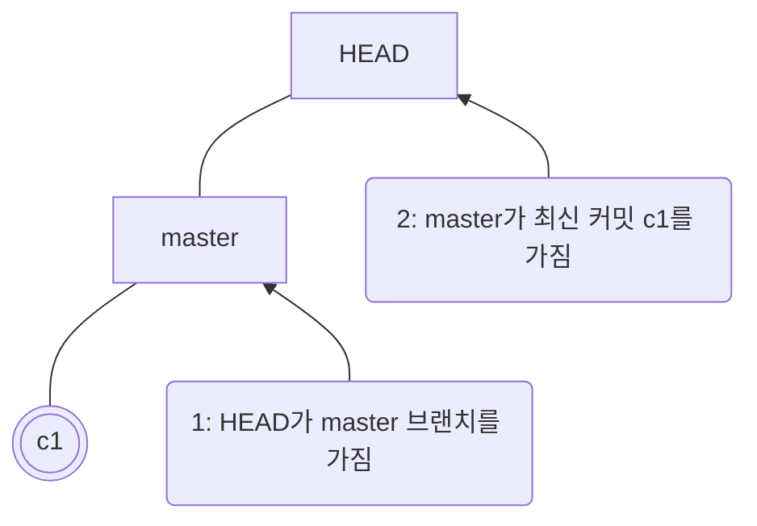


4. 이제 sub라는 브랜치를 만들겠다. sub 브랜치 또한 c1 커밋을 가리킨다.

``` shell
kgm09@kim_gyeong_min MINGW64 ~/Documents/test (master)
$ git branch sub

```

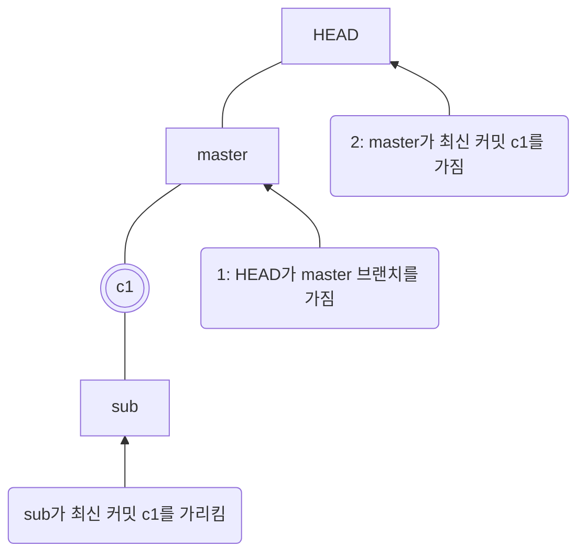


5. ==다시 한 번 빔에서 c2.txt 파일을 만들고 숫자 '2'를 입력한 후 저장한다.== 그리고 방금 만든 c2.txt를 스테이지에 올리고 'c2'라는 메시지와 함께 커밋한다. 이제 master는 c2 커밋을 가리키게 된다. HEAD는 그대로 master 브랜치를 가리키고 있다.
``` shell
kgm09@kim_gyeong_min MINGW64 ~/Documents/test (master)
$ git add c2.txt
warning: in the working copy of 'c2.txt', LF will be replaced by CRLF the next time Git touches it

kgm09@kim_gyeong_min MINGW64 ~/Documents/test (master)
$ git commit -m "c2"
[master de9c21d] c2
 1 file changed, 1 insertion(+)
 create mode 100644 c2.txt

kgm09@kim_gyeong_min MINGW64 ~/Documents/test (master)
$ ls
c1.txt  c2.txt  test.txt

kgm09@kim_gyeong_min MINGW64 ~/Documents/test (master)
$

```

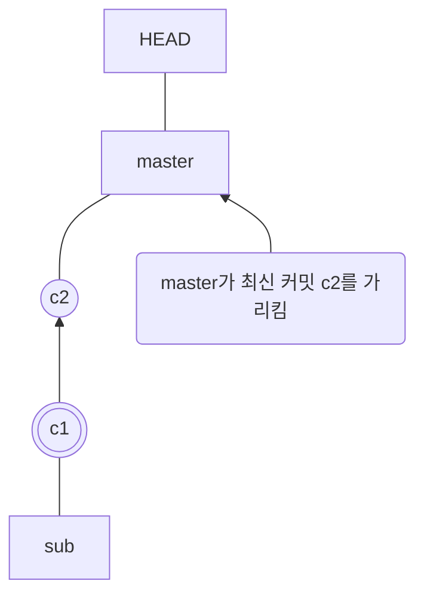

6. 이제 sub 브랜치에 커밋을 만들어 보겠다. master 브랜치에서 sub 브랜치로 이동하려면 git checkout 명령을 사용한다. ==**앞에서도 자주 사용했던 git checkout 명령은 HEAD가 가리키는 것을 제어할 수 있다.**== 그래서 아래 명령을 실행하면 HEAD가 sub 브랜치를 가리키게 된다.

``` shell
kgm09@kim_gyeong_min MINGW64 ~/Documents/test (master)
$ git checkout sub
Switched to branch 'sub'

kgm09@kim_gyeong_min MINGW64 ~/Documents/test (sub)
$

```

7. sub 브랜치에서 빔에서 사용해 s1.txt 문서를 만들고 내용은 's1'이라고 입력하고 저장한다. s1.txt 문서를 스테이지에 올리고 's1'이라는 메시지와 함께 커밋한다. 이제 HEAD는 sub 브랜치를 가리키고 sub는 s1 커밋을 가리키고 있다.

``` shell

kgm09@kim_gyeong_min MINGW64 ~/Documents/test (sub)
$ vim s1.txt

kgm09@kim_gyeong_min MINGW64 ~/Documents/test (sub)
$ git add s1.txt
warning: in the working copy of 's1.txt', LF will be replaced by CRLF the next time Git touches it

kgm09@kim_gyeong_min MINGW64 ~/Documents/test (sub)
$ git commit -m "s`"
> ^C

kgm09@kim_gyeong_min MINGW64 ~/Documents/test (sub)
$ git commit -m "s1"
[sub 53f0ba8] s1
 1 file changed, 1 insertion(+)
 create mode 100644 s1.txt

kgm09@kim_gyeong_min MINGW64 ~/Documents/test (sub)
$

```


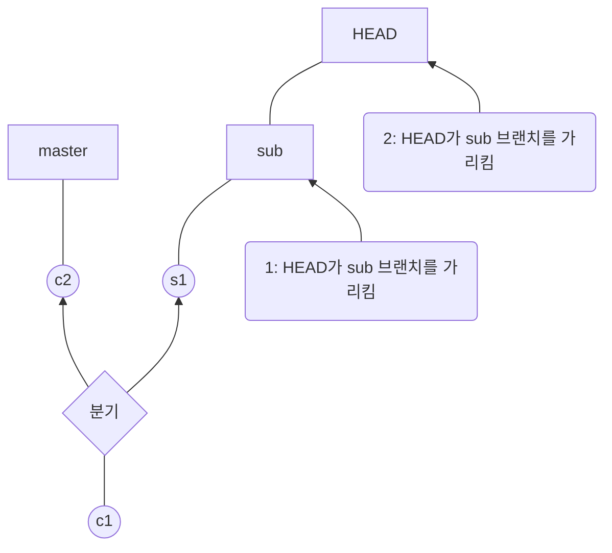


8. 브랜치가 여러 개일 때 reset 명령은 어떻게 사용할 수 있을까? 02장에서는 reset 명령으로 master 브랜치에 있던 여러 커밋 중 하나를 골라서 되돌아갔다. ==브랜치에 여러 개일 때는 현재 브랜치가 아닌 다른 브랜치에 있는 커밋을 골라서 최신 커밋으로 지정할 수 있다.== 예를 들어 sub 브랜치에 있는 상태에서 master 브랜치에 있는 c2 커밋을 sub 브랜치의 최신 커밋으로 지정할 수 있다. 먼저 git log 명령을 사용해서 c2 커밋의 커밋 해시를 확인해야 한다.

``` shell
kgm09@kim_gyeong_min MINGW64 ~/Documents/test (sub)
$ git log --oneline --branches
53f0ba8 (HEAD -> sub) s1
de9c21d (master) c2
37d487d c1

kgm09@kim_gyeong_min MINGW64 ~/Documents/test (sub)
$

```

9. git reset 명령 다음에 c2 커밋의 커밋 해시를 입력한다. 지금 여기서는 'de9c21d' 이다.


``` shell
kgm09@kim_gyeong_min MINGW64 ~/Documents/test (sub)
$ git log --oneline --branches
53f0ba8 (HEAD -> sub) s1
de9c21d (master) c2
37d487d c1

kgm09@kim_gyeong_min MINGW64 ~/Documents/test (sub)
$ git reset de9c21d
Unstaged changes after reset:
D       c2.txt

kgm09@kim_gyeong_min MINGW64 ~/Documents/test (sub)
$

```

10. 결과는 어떻게 되었을까? git log 명령을 사용해서 확인해 보겠다.

``` shell
kgm09@kim_gyeong_min MINGW64 ~/Documents/test (sub)
$ git log --oneline --branches --graph

```

11. sub 브랜치의 최신 커밋이 master 브랜치의 최신 커밋인 c2로 바뀌었다. 그리고 HEAD 그대로 sub 브랜치를 가리키고 있다. 이렇게 git reset 명령을 사용하면 현재 브랜치가 가리키는 커밋을 여러 브랜치 사이를 넘나들면서 제어할 수 있다. 이제 sub 브랜치는 c2 커밋을 가리키고 있기 때문에 원래 가리키고 있던 s1 커밋은 연결이 끊기면서 삭제된다.

``` shell
kgm09@kim_gyeong_min MINGW64 ~/Documents/test (sub)
$ git log --oneline --branches
de9c21d (HEAD -> sub, master) c2
37d487d c1


```

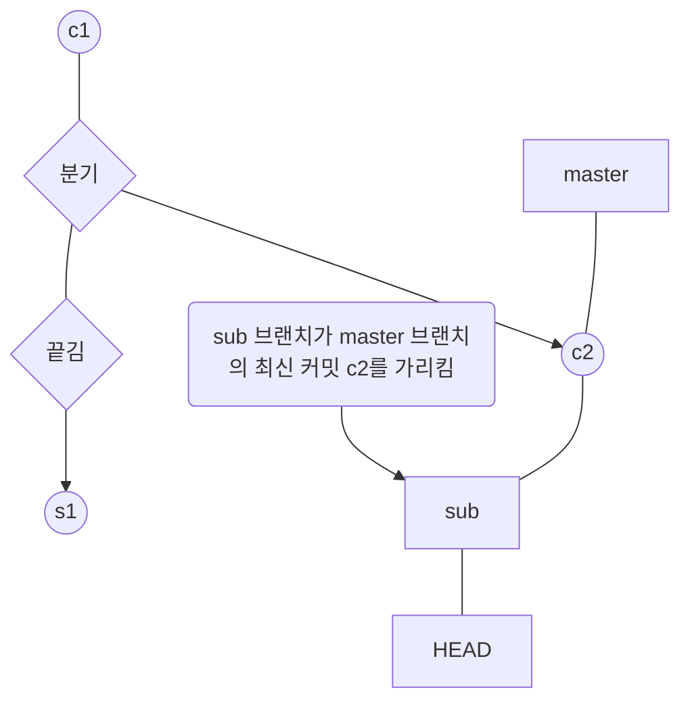

정리해 보자면, git checkout 명령을 사용하면 HEAD를 제어해서 브랜치를 이동할 수 있다. git reset 명령을 이용하면 HEAD가 가리키고 있는 브랜치의 최신 커밋을 원하는 커밋으로 지정할 수 있다. 이때 어떤 브랜치에 있는 커밋이든 지정할 수 있으며, 명령을 수행한 뒤 연결이 끊긴 커밋은 삭제된다.


### 수정 중인 파일 감추기 및 되돌리기 - git stash


브랜치에서 파일을 수정하고 커밋하지 않은 않은 상태에서 급하게 다른 파일을 커밋해야 할 경우가 있다==. 아직 커밋하지 않은 파일들을 그냥 두어도 상관은 없지만 계속 커밋하려는 메시지가 나타나기 때문에 번거롭다. 실수로 다른 파일과 함께 커밋이 될 수도 있고.==이럴 때 아직 커밋하지 않고 작업 중인 파일들을 잠시 감춰둘 수 있다. 그리고 당장 필요한 작업들을 끝낸 후 다시 감춰둔 파일들을 꺼내오면 된다.


1. 홈 디렉터리로 이동한 후 st라는 저장소를 만들고 st 디렉터리로 이동한다.

``` shell

kgm09@kim_gyeong_min MINGW64 ~
$ cd Documents

kgm09@kim_gyeong_min MINGW64 ~/Documents
$ git init st
Initialized empty Git repository in C:/Users/kgm09/Documents/st/.git/

kgm09@kim_gyeong_min MINGW64 ~/Documents
$ cd st


```

2. git stach 명령을 사용하려면 파일이 tracked 상태여야 한다. 즉 한 번은 커밋한 상태여야 한다. 먼저 빔을 사용해 f1.txt 파일을 작성한다. 아무 내용이나 간단하게 입력해서 저장한 후 스테이지에 올리고 'f1'이라는 메시지와 함께 커밋한다.

``` shell
kgm09@kim_gyeong_min MINGW64 ~/Documents/st (master)
$ git add f1.txt
warning: in the working copy of 'f1.txt', LF will be replaced by CRLF the next time Git touches it

kgm09@kim_gyeong_min MINGW64 ~/Documents/st (master)
$ git commit -m "f1"
[master (root-commit) 9b97753] f1
 1 file changed, 1 insertion(+)
 create mode 100644 f1.txt

kgm09@kim_gyeong_min MINGW64 ~/Documents/st (master)
$

```

3. f2.txt 파일도 만들고 내용을 입력한 후 저장한다. f2.txt 파일도 스테이지에 올린 후 'f2'라는 메시지와 함께 커밋한다.

``` shell
kgm09@kim_gyeong_min MINGW64 ~/Documents/st (master)
$ vim f2.txt

kgm09@kim_gyeong_min MINGW64 ~/Documents/st (master)
$ git add f2.txt
warning: in the working copy of 'f2.txt', LF will be replaced by CRLF the next time Git touches it

kgm09@kim_gyeong_min MINGW64 ~/Documents/st (master)
$ git commit -m "f2"
[master 0116b8c] f2
 1 file changed, 1 insertion(+)
 create mode 100644 f2.txt

kgm09@kim_gyeong_min MINGW64 ~/Documents/st (master)
$


```

4. 빔에서 f1.txt 파일을 연 후 아무렇게나 수정하고 저장한다. f2.txt 파일도 수정하고 저장한다.

``` shell
kgm09@kim_gyeong_min MINGW64 ~/Documents/st (master)
$ vim f1.txt

kgm09@kim_gyeong_min MINGW64 ~/Documents/st (master)
$ vim f2.txt


```

5. git status 명령을 실행해 보면 현재 브랜치에 f1.txt와 f2.txt가 수정되었다고 나타난다.

``` shell
kgm09@kim_gyeong_min MINGW64 ~/Documents/st (master)
$ git status
On branch master
Changes not staged for commit:
  (use "git add <file>..." to update what will be committed)
  (use "git restore <file>..." to discard changes in working directory)
        modified:   f1.txt
        modified:   f2.txt

no changes added to commit (use "git add" and/or "git commit -a")

kgm09@kim_gyeong_min MINGW64 ~/Documents/st (master)
$

```

6. 이제 f1.txt 파일과 f2.txt 파일을 커밋하기 전에 다른 파일을 수정해야 한다고 가정해 본다. 수정 내용을 어디엔가 보관하려면 git stash 명령을 사용한다. git stash save 또는 git stash라고만 해 된다.


``` shell
kgm09@kim_gyeong_min MINGW64 ~/Documents/st (master)
$ git stash
warning: in the working copy of 'f1.txt', LF will be replaced by CRLF the next time Git touches it
warning: in the working copy of 'f2.txt', LF will be replaced by CRLF the next time Git touches it
Saved working directory and index state WIP on master: 0116b8c f2

kgm09@kim_gyeong_min MINGW64 ~/Documents/st (master)
$

```

7. 다시 한번 git status 명령을 실행해 보라. 조금 전에 나타나던 modified 메시지가 사라졌다.

``` shell
kgm09@kim_gyeong_min MINGW64 ~/Documents/st (master)
$ git status
On branch master
nothing to commit, working tree clean

kgm09@kim_gyeong_min MINGW64 ~/Documents/st (master)
$

```


8. 같은 방법으로 여러 파일을 수정한 후 따로 보관할 수 있으며, 이렇게 감춘 파일들을 stash 목록에서 확인할 수 있다. 가장 먼저 감춘 것은 stash@{0}에 들어있는데, 앞으로 다른 파일이 추가되면 기존 파일은 stash@{0}로 옮겨지고 새로 추가된 파일은 stash@{0}에 담긴다. 즉 가장 최근에 보관한 것이 stash@{0}에 담긴다. 먼저 감춘 것을 아래에, 가장 최근에 감춘 것을 위에 쌓기 때문에 stash 스택(stack)이라고도 한다.

``` shell
kgm09@kim_gyeong_min MINGW64 ~/Documents/st (master)
$ git stash list
stash@{0}: WIP on master: 0116b8c f2

kgm09@kim_gyeong_min MINGW64 ~/Documents/st (master)
$

```

9. 급한 작업을 모두 마쳤다면 감춰둔 파일을 꺼내와 계속 수정하거나 커밋할 수 있다. git stash 명령 뒤에 pop를 추가하면 stash 목록에서 가장 최근 목록을 되돌린다. 여기에서 f1.txt와 f2.txt가 수정된 상태로 되돌아간다.

``` shell
kgm09@kim_gyeong_min MINGW64 ~/Documents/st (master)
$ git stash pop
On branch master
Changes not staged for commit:
  (use "git add <file>..." to update what will be committed)
  (use "git restore <file>..." to discard changes in working directory)
        modified:   f1.txt
        modified:   f2.txt

no changes added to commit (use "git add" and/or "git commit -a")
Dropped refs/stash@{0} (59e746c0b960e8825de34826f293b5bd392bb6a6)

kgm09@kim_gyeong_min MINGW64 ~/Documents/st (master)
$

```


---

#### 한 걸음 더!: stash apply와 stash drop

stash 목록에 저장된 수정 내용을 나중에 또 사용할지도 모른다면 git stash apply 명령을 사용한다. stash 목록에서 가장 최근 항목을 되돌리지만 저장했던 내용은 그대로 남겨둔다.

``` shell
kgm09@kim_gyeong_min MINGW64 ~/Documents/st (master)
$ git stash list
stash@{0}: WIP on master: 0116b8c f2

kgm09@kim_gyeong_min MINGW64 ~/Documents/st (master)
$ git status
On branch master
nothing to commit, working tree clean

kgm09@kim_gyeong_min MINGW64 ~/Documents/st (master)
$ git stash apply
On branch master
Changes not staged for commit:
  (use "git add <file>..." to update what will be committed)
  (use "git restore <file>..." to discard changes in working directory)
        modified:   f1.txt
        modified:   f2.txt

no changes added to commit (use "git add" and/or "git commit -a")

kgm09@kim_gyeong_min MINGW64 ~/Documents/st (master)
$ git stash list
stash@{0}: WIP on master: 0116b8c f2


```


git stash drop 명령은 stash 목록에서 가장 최근 항목을 삭제한다.