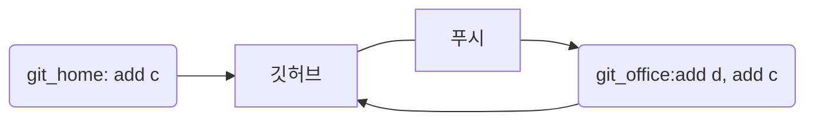
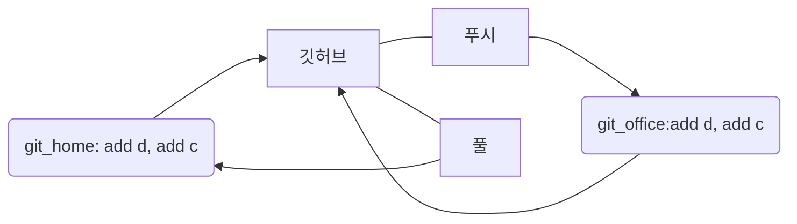
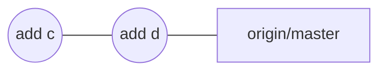
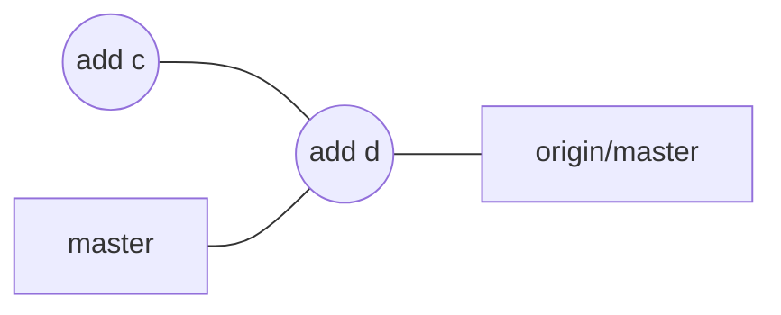
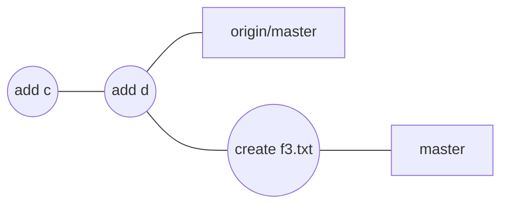
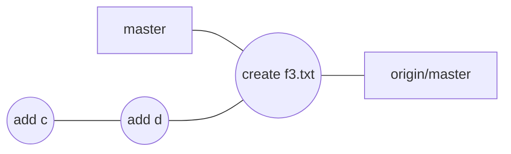
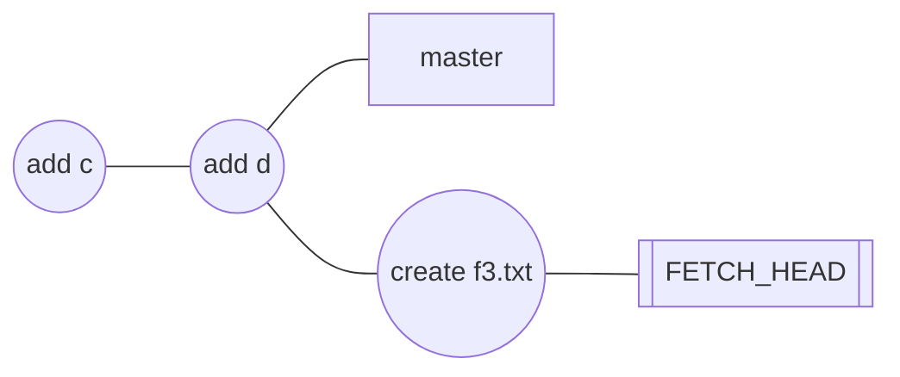
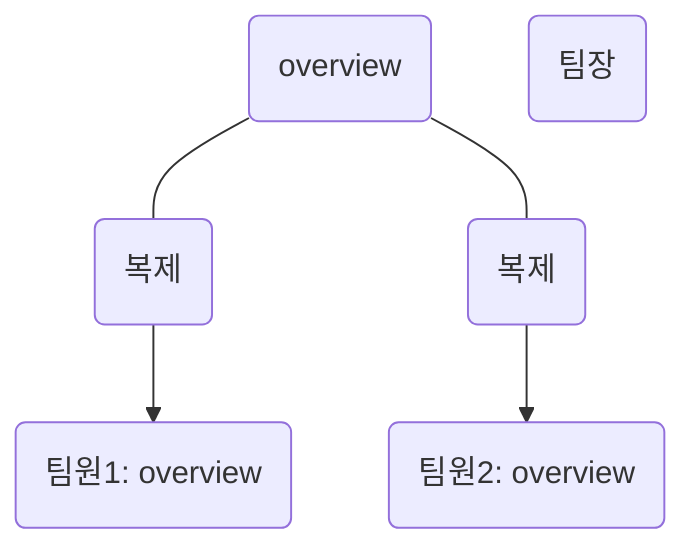
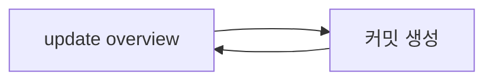

---
# 05-1 여러 컴퓨터에서 원격 저장소와 함께 사용하기


이제부터 git_home과 git_office 라는 2개의 디렉터리를 만들어 깃허브 협업을 연습하겠다. 1인 프로젝트로 한다면 git_home과 git_office를 개인 컴퓨터의 저장소와 회사 컴퓨터의 저장소라고 상상해도 되고, 하나는 pc, 하나는 노트북의 저장소라고 상상해도 된다.


모두 하나의 깃허브 계정으로 둘 이상의 컴퓨터에서 원격 저장소를 공유해 버전을 관리하는 방법이다.


### 원격 저장소 복제하기 - git clone

클론(clone): 원격 저장소를 기존에 연결된 지역 저장소 외에 다른 지역 저장소에서 사용하려면 원격 저장소에 담기 내용 전체를 지역 저장소로 가져와야 한다. 원격 저장소를 지역 저장소로 똑같이 가져오는 것을 말한다. **클로닝(cloning)** 이라고도 한다.


1. 04장에서 만든 test-1 이라는 원격 저장소를 계속 사용하겠다. 깃허브에 있는 test-1 저장소를 git_home이라는 저장소로 복제하겠다. [Clone or download]를 누른 후 'Clone with HTTPS' 항목에 있는 아이콘을 눌러서 원격 저장소의 주소를 복사한다.
2. 터미널 창에서 git_home 디렉터리와 git_office 디렉터리를 만들 위치로 이동한다. 여기서는 홈 디렉터리를 만들겠다. git clone 다음에 복사한 소스를 붙여 넣고 복제할 디렉터리 이름을 입력하면 된다. 이때 git_home이라는 디렉터리가 없다면 자동으로 디렉터리가 만들어진다.

``` shell
kgm09@kim_gyeong_min MINGW64 ~/Documents
$ git clone https://github.com/kgm0927/test-1.git git_home
Cloning into 'git_home'...
remote: Enumerating objects: 9, done.
remote: Counting objects: 100% (9/9), done.
remote: Compressing objects: 100% (4/4), done.
remote: Total 9 (delta 0), reused 6 (delta 0), pack-reused 0
Receiving objects: 100% (9/9), done.


```

3. 원격 저장소의 내용을 git_office 디렉터리에도 복제하겠다. 2번에서 사용했던 소스 중에서 git_home 부분만 git_office로 수정하고, 나머지 소스는 똑같이 입력하면 된다. 개인 컴퓨터와 회사 컴퓨터 양쪽에 복제됐다고 생각하면 된다.

``` shell
kgm09@kim_gyeong_min MINGW64 ~/Documents
$ git clone https://github.com/kgm0927/test-1.git git_office
Cloning into 'git_office'...
remote: Enumerating objects: 9, done.
remote: Counting objects: 100% (9/9), done.
remote: Compressing objects: 100% (4/4), done.
remote: Total 9 (delta 0), reused 6 (delta 0), pack-reused 0
Receiving objects: 100% (9/9), done.

```


4. 터미널 창에서 ls -al 명령을 사용해 방금 만든 디렉터리를 확인한다.

``` shell
kgm09@kim_gyeong_min MINGW64 ~/Documents
$ ls -al
total 1778
drwxr-xr-x 1 kgm09 197609       0 Mar 11 15:30  ./
drwxr-xr-x 1 kgm09 197609       0 Mar 11 13:39  ../
drwxr-xr-x 1 kgm09 197609       0 Mar  5 19:17  GitHub/
lrwxrwxrwx 1 kgm09 197609      20 Dec 23 16:22 'My Music' -> /c/Users/kgm09/Music/
lrwxrwxrwx 1 kgm09 197609      23 Dec 23 16:22 'My Pictures' -> /c/Users/kgm09/Pictures/
lrwxrwxrwx 1 kgm09 197609      21 Dec 23 16:22 'My Videos' -> /c/Users/kgm09/Videos/
drwxr-xr-x 1 kgm09 197609       0 Dec 23 22:20 'Visual Studio 2022'/
-rw-r--r-- 1 kgm09 197609   28160 Dec 26 11:35 'Welcome to Hwp.hwp'
drwxr-xr-x 1 kgm09 197609       0 Mar 11 15:09  connect-ssh/
-rw-r--r-- 1 kgm09 197609     402 Dec 23 16:27  desktop.ini
-rw-r--r-- 1 kgm09 197609   41228 Mar  4 08:46  download.pdf
-rw-r--r-- 1 kgm09 197609   73319 Mar  5 09:59  emdfhrrma.pdf
drwxr-xr-x 1 kgm09 197609       0 Mar 11 15:29  git_home/
drwxr-xr-x 1 kgm09 197609       0 Mar 11 15:30  git_office/


kgm09@kim_gyeong_min MINGW64 ~/Documents
$

```


5. git_home 디렉터리와 git_office 디렉터리에 같은 내용이 저장되어 있는지 확인해 보겠다. 먼저 git_home 디렉터리로 이동한 후 git log 명령을 입력해 본다. 필자의 경우는 3개의 커밋이 저장되어 있다. 커밋의 개수는 다를 수 있다.

``` shell
kgm09@kim_gyeong_min MINGW64 ~/Documents
$ cd git_home

kgm09@kim_gyeong_min MINGW64 ~/Documents/git_home (master)
$ git log
commit a173515967e036ee45ea209c822fe42c06ef2119 (HEAD -> master, origin/master, origin/HEAD)
Author: kgm0927 <87554722+kgm0927@users.noreply.github.com>
Date:   Mon Mar 11 13:24:10 2024 +0900

    Create f2.txt

commit a51d5a4f3b8a140751bb9e70bdac3a7651e74507
Author: kgm0927 <initial929@gmail.com>
Date:   Mon Mar 11 13:05:26 2024 +0900

    add b

commit fbef7f82c0d787e15a3b5329f24400ff5d291333
Author: kgm0927 <initial929@gmail.com>
Date:   Mon Mar 11 12:33:06 2024 +0900

    add a

kgm09@kim_gyeong_min MINGW64 ~/Documents/git_home (master)
$

```

6. 다시 git_office 디렉터리로 이동한 후 git log 명령을 실행해라. git_home 디렉터리와 똑같은 커밋이 저장되어 있는 것을 확인할 수 있다.

``` shell
kgm09@kim_gyeong_min MINGW64 ~/Documents/git_home (master)
$ cd ..

kgm09@kim_gyeong_min MINGW64 ~/Documents
$ cd git_office

kgm09@kim_gyeong_min MINGW64 ~/Documents/git_office (master)
$ git log
commit a173515967e036ee45ea209c822fe42c06ef2119 (HEAD -> master, origin/master, origin/HEAD)
Author: kgm0927 <87554722+kgm0927@users.noreply.github.com>
Date:   Mon Mar 11 13:24:10 2024 +0900

    Create f2.txt

commit a51d5a4f3b8a140751bb9e70bdac3a7651e74507
Author: kgm0927 <initial929@gmail.com>
Date:   Mon Mar 11 13:05:26 2024 +0900

    add b

commit fbef7f82c0d787e15a3b5329f24400ff5d291333
Author: kgm0927 <initial929@gmail.com>
Date:   Mon Mar 11 12:33:06 2024 +0900

    add a

kgm09@kim_gyeong_min MINGW64 ~/Documents/git_office (master)
$

```


7. ==이렇게 원격 저장소를 복제하면 자동으로 지역 저장소와 원격 저장소가 연결된다.== git_home 디렉터리나 git_office 디렉터리에서 git remote -v 명령을 사용하면 연결되어 있는지 확인할 수 있다.

``` shell

kgm09@kim_gyeong_min MINGW64 ~/Documents/git_office (master)
$ git remote -v
origin  https://github.com/kgm0927/test-1.git (fetch)
origin  https://github.com/kgm0927/test-1.git (push)

kgm09@kim_gyeong_min MINGW64 ~/Documents/git_office (master)
$

```


### 개인 컴퓨터에서 작업하고 올리기

같은 원격 저장소를 복제한 2대의 컴퓨터 중 한 곳에서 커밋을 만들고 푸시해 보겠다. 여기에서는 git_home 디렉터리(개인 컴퓨터)에서 작업한다.


1. git_home 디렉터리에서 텍스트 문서를 열고 간단한 내용을 추가해 보자. 여기에서는 f1.txt 문서에 c 라는 문자를 추가해 보겠다.

``` shell

kgm09@kim_gyeong_min MINGW64 ~/Documents/git_office (master)
$ cd ..

kgm09@kim_gyeong_min MINGW64 ~/Documents
$ cd git_home

kgm09@kim_gyeong_min MINGW64 ~/Documents/git_home (master)
$ vim f1.txt

kgm09@kim_gyeong_min MINGW64 ~/Documents/git_home (master)
$


a
b
c
~
~
~
~
~
~
~
~
~
~
~

```


2. f1.txt 파일을 스테이징하고 커밋한다. git commit 명령에서 -am 옵션을 사용하면 스테이징과 커밋을 한꺼번에 할 수 있다. 커밋 메시지는 'add c'라고 지정했다. 그리고 git push 명령을 사용해 커밋을 원격 저장소에 올린다.

``` shell

kgm09@kim_gyeong_min MINGW64 ~/Documents/git_home (master)
$ git commit -am "add c"
[master 6f19b4e] add c
 1 file changed, 1 insertion(+)

kgm09@kim_gyeong_min MINGW64 ~/Documents/git_home (master)
$ git push
Enumerating objects: 5, done.
Counting objects: 100% (5/5), done.
Delta compression using up to 6 threads
Compressing objects: 100% (2/2), done.
Writing objects: 100% (3/3), 263 bytes | 263.00 KiB/s, done.
Total 3 (delta 0), reused 0 (delta 0), pack-reused 0
To https://github.com/kgm0927/test-1.git
   a173515..6f19b4e  master -> master

kgm09@kim_gyeong_min MINGW64 ~/Documents/git_home (master)
$

```

3. 이제 깃허브의 원격 저장소로 접속해서 제대로 커밋이 올라왔는지 확인해 볼까? 깃허브 화면 위에 표시된[commits]을 누른다.
4. 마지막으로 커밋한 'add c'라는 커밋이 올라와 았다. 이렇게 원격 저장소의 내용을 복제한 지역 저장소에서 내용을 수정하고 커밋한 후 원격 저장소에 올렸다.


### 회사 컴퓨터에서 내려받아 작업하기


개인 컴퓨터에서 커밋을 푸시했기 때문에 회사 컴퓨터에서 원격 저장소를 복제했을 때와 원격 저장소의 커밋 상황이 달라졌다. 따라서 회사 컴퓨터에서 작업하려면 먼저 원격 저장소에 새로 올라온 커밋을 가져와야 한다.

1. 앞에서 복제 과정을 거쳤기 때문에 git_office의 master 브랜치는 origin에 이미 연결되어 있다. 터미널 창에서 git_office 디렉터리로 이동한 후 git pull 명령을 입력하면 앞에서 원격 저장소에 새로 올라온 커밋을 가져온다.

``` shell
kgm09@kim_gyeong_min MINGW64 ~/Documents/git_home (master)
$ cd ../git_office

kgm09@kim_gyeong_min MINGW64 ~/Documents/git_office (master)
$ git pull
remote: Enumerating objects: 5, done.
remote: Counting objects: 100% (5/5), done.
remote: Compressing objects: 100% (2/2), done.
remote: Total 3 (delta 0), reused 3 (delta 0), pack-reused 0
Unpacking objects: 100% (3/3), 243 bytes | 40.00 KiB/s, done.
From https://github.com/kgm0927/test-1
   a173515..6f19b4e  master     -> origin/master
Updating a173515..6f19b4e
Fast-forward
 f1.txt | 1 +
 1 file changed, 1 insertion(+)

kgm09@kim_gyeong_min MINGW64 ~/Documents/git_office (master)
$

```

2. 저장소에 있는 f1.txt 파일을 수정해 보겠다.
``` shell

kgm09@kim_gyeong_min MINGW64 ~/Documents/git_office (master)
$ vim f1.txt

```


3. 개인 컴퓨터(git_home)에서 수정했던 'c'가 포함되어 있을 것이다. 회사 컴퓨터(git_office)에서는 영문자 d를 추가하고 저장한다.
```
a
b
c
d
~
~
~
~
~
~
~
~
~
~
~
~

```


4. 이제 'add d'라는 메시지와 함께 커밋을 만든 후 원격 저장소로 표시한다.

``` shell
kgm09@kim_gyeong_min MINGW64 ~/Documents/git_office (master)
$ git commit -am "add d"
[master 92e86ca] add d
 1 file changed, 1 insertion(+)

kgm09@kim_gyeong_min MINGW64 ~/Documents/git_office (master)
$ git push
Enumerating objects: 5, done.
Counting objects: 100% (5/5), done.
Delta compression using up to 6 threads
Compressing objects: 100% (2/2), done.
Writing objects: 100% (3/3), 264 bytes | 264.00 KiB/s, done.
Total 3 (delta 0), reused 0 (delta 0), pack-reused 0
To https://github.com/kgm0927/test-1.git
   6f19b4e..92e86ca  master -> master

kgm09@kim_gyeong_min MINGW64 ~/Documents/git_office (master)
$

```


5. 웹 브라우저에 깃 허브 저장소를 열고 [commits]을 확인해 보라. 커밋 수가 1개 더 늘어났을 것이고, 그 부분을 누르면 방금 회사 컴퓨터에서 푸시한 커밋이 올라와 있을 것이다.




5. 다시 개인 컴퓨터(git_home 디렉터리)에서 작업할 때는 git pull 명령으로 원격 저장소에 있는 최신 커밋을 가져와 작업을 시작한다. git log 명령으로 확인해 보면 회사 컴퓨터(git_office 디렉터리)에서 푸시했던 'add d'커밋이 개인 컴퓨터에도 들어와 있을 것이다.

``` shell
kgm09@kim_gyeong_min MINGW64 ~/Documents/git_office (master)
$ cd ../git_home

kgm09@kim_gyeong_min MINGW64 ~/Documents/git_home (master)
$ git pull
remote: Enumerating objects: 5, done.
remote: Counting objects: 100% (5/5), done.
remote: Compressing objects: 100% (2/2), done.
remote: Total 3 (delta 0), reused 3 (delta 0), pack-reused 0
Unpacking objects: 100% (3/3), 244 bytes | 40.00 KiB/s, done.
From https://github.com/kgm0927/test-1
   6f19b4e..92e86ca  master     -> origin/master
Updating 6f19b4e..92e86ca
Fast-forward
 f1.txt | 1 +
 1 file changed, 1 insertion(+)

kgm09@kim_gyeong_min MINGW64 ~/Documents/git_home (master)
$ git log
commit 92e86cad3a6af2bd9baedd1a4e2d97115a93e12b (HEAD -> master, origin/master, origin/HEAD)
Author: kgm0927 <initial929@gmail.com>
Date:   Mon Mar 11 15:59:14 2024 +0900

    add d

commit 6f19b4e40507f7230bea65ff3f117148209048a9
Author: kgm0927 <initial929@gmail.com>
Date:   Mon Mar 11 15:49:46 2024 +0900

    add c

commit a173515967e036ee45ea209c822fe42c06ef2119
Author: kgm0927 <87554722+kgm0927@users.noreply.github.com>
Date:   Mon Mar 11 13:24:10 2024 +0900

    Create f2.txt

commit a51d5a4f3b8a140751bb9e70bdac3a7651e74507
Author: kgm0927 <initial929@gmail.com>
Date:   Mon Mar 11 13:05:26 2024 +0900

    add b

commit fbef7f82c0d787e15a3b5329f24400ff5d291333
Author: kgm0927 <initial929@gmail.com>
Date:   Mon Mar 11 12:33:06 2024 +0900

    add a

kgm09@kim_gyeong_min MINGW64 ~/Documents/git_home (master)
$

```




하나의 원격 저장소에 둘 이상의 컴퓨터를 연결해서 사용한다면 풀과 푸시를 습관화하는 것이 좋다. 그러면 어떤 컴퓨터에서 접속하든 항상 최신 소스를 유지할 수 있을 것이다.


---

# 05-2 원격 브랜치 정보 가져오기


git pull 명령은 원격 저장소의 최신 커밋을 지역 저장소에 합쳐준다. 하지만 최신 커밋을 합치지 전에 원격 저장소에 어떤 변화가 있는지 먼저 살펴보아야 한다. 이럴 때는 원격 브랜치에서 정보만 가져올 수 있다. **이 절에는 원격 브랜치의 역할과 원격 브랜치에서 정보를 가져올 수 있는 방법**, **가져온 정보를 지역 저장소에 병합하는 과정**까지 알아보겠다.


1. 깃허브에서 test-1 저장소로 접속한 후 [commit]를 눌러 보라. 이 책의 실습을 따라왔다면 'add d'라는 커밋이 마지막일 것이다.

여기에서 원격 저장소에 있는 HEAD는 원격 저장소의 master 브랜치를 가리킬 것이고, 원격 master 브랜치는 'add d'라는 최종 커밋을 가리킨다.


>[!중요한 점] 그림에서 HEAD는 생략했다. 3장을 참고하면 볼 수 있을 것이다.





2. 터미널 창에서 git_home 디렉터리로 이동한 후 git log 명령으로 커밋 상태를 확인해 보라. 'add d' 앞에 (HEAD -> master, origin/master, origin/HEAD)라고 표시되어 있다.


``` shell
kgm09@kim_gyeong_min MINGW64 ~/Documents/git_home (master)
$ git log --oneline
92e86ca (HEAD -> master, origin/master, origin/HEAD) add d
6f19b4e add c
a173515 Create f2.txt
a51d5a4 add b
fbef7f8 add a

```

==여기에서 HEAD-> master는 이 커밋이 지역 저장소의 최종 커밋이라는 뜻==이고, ==origin/master는 원격 저장소의 최종 커밋이라는 뜻이다.== 아직 git_home 디렉터리가 원격 저장소를 복제한 상태 그대로이기 때문에 지역 저장소와 원격 저장소 모두의 최종 커밋이 같다.




3. git_home디렉터리에서 새로운 커밋을 만들어 보렜다. 빔을 사용해 f3.txt 파일을 만든 후 간단히 'a'라고 입력하겠다. 파일 내용은 어떤 것을 입력해도 상관이 없다. 여기에서는 새 파일을 만드는 것이 중요하다.

``` shell
a
~
~
~
~
~

```

4. f3.txt를 스테이지에 올린 후 커밋을 만든다. 커밋 메시지는 'create f3.txt'라고 해 보겠다. 

``` shell
kgm09@kim_gyeong_min MINGW64 ~/Documents/git_home (master)
$ git add f3.txt
warning: in the working copy of 'f3.txt', LF will be replaced by CRLF the next time Git touches it

kgm09@kim_gyeong_min MINGW64 ~/Documents/git_home (master)
$ git commit -m "crete f3.txt"
[master bb12679] crete f3.txt
 1 file changed, 1 insertion(+)
 create mode 100644 f3.txt

kgm09@kim_gyeong_min MINGW64 ~/Documents/git_home (master)
$

```

5. git log --oneline 명령을 사용해 커밋 로그를 한눈에 확인해 보겠다. (HEAD->master)는 방금 커밋한 'create f3.txt'를 가리킨다. 지역 저장소의 최종 커밋이 'create f3.txt' 커밋이라는 뜻이다. 하지만 (origin/master, origin/HEAD)는 아직 'add d' 커밋을 가리키고 있다.


``` shell
kgm09@kim_gyeong_min MINGW64 ~/Documents/git_home (master)
$ git log --oneline
bb12679 (HEAD -> master) crete f3.txt
92e86ca (origin/master, origin/HEAD) add d
6f19b4e add c
a173515 Create f2.txt
a51d5a4 add b
fbef7f8 add a
```




6. 이 상태에서 git status를 입력해 보라. 현재 master 브랜치가 origin에 있는 원격 master 브랜치의 버전보다 하나 앞서 있다는 것을 알 수 있다. 그리고 git push 명령으로 지역 저장소의 커밋을 원격 저장소로 올리라고 알려준다.
``` shell
kgm09@kim_gyeong_min MINGW64 ~/Documents/git_home (master)
$ git status
On branch master
Your branch is ahead of 'origin/master' by 1 commit.
  (use "git push" to publish your local commits)

nothing to commit, working tree clean

kgm09@kim_gyeong_min MINGW64 ~/Documents/git_home (master)
$

```


7. 이제 git push 명령을 사용해서 'create f3.txt'라는 커밋을 원격 저장소로 올린다. 그러고나서 커밋 로그를 확인해 본다. 푸시하기 전까지는 master 브랜치와 origin/master 브랜치가 가리키는 커밋이 달랐지만, 푸시한 후에는 master와 origin/master 브랜치가 같은 커밋을 가리키게 된다.
``` shell
kgm09@kim_gyeong_min MINGW64 ~/Documents/git_home (master)
$ git push
Enumerating objects: 4, done.
Counting objects: 100% (4/4), done.
Delta compression using up to 6 threads
Compressing objects: 100% (2/2), done.
Writing objects: 100% (3/3), 289 bytes | 289.00 KiB/s, done.
Total 3 (delta 0), reused 1 (delta 0), pack-reused 0
To https://github.com/kgm0927/test-1.git
   92e86ca..bb12679  master -> master

kgm09@kim_gyeong_min MINGW64 ~/Documents/git_home (master)
$ git log --oneline
bb12679 (HEAD -> master, origin/master, origin/HEAD) crete f3.txt
92e86ca add d
6f19b4e add c
a173515 Create f2.txt
a51d5a4 add b
fbef7f8 add a

```





### 원격 브랜치 정보 가져오기 -git fetch

패치(fetch)는 '불러오다, 가져오다'라는 뜻이다. 그래서 git fetch 명령은 원격 저장소의 정보를 가져오는 기능을 한다. 풀 명령이 원격 저장소의 커밋을 가져와서 무조건 지역 저장소와 합친다면, 패치 명령은 원격 브랜치에 어떤 변화가 있는지 그 정보만 가져온다. 

팀 작업을 할 대 다른 사람인 수정한 소스를 한번 더 훑어보고 직업 저장소와 합치고 싶다면 풀 대신 패치를 사용하여 커밋을 가져온 다음 지역 저장소와 합치면 된다.


1. 회사 컴퓨터 저장소로 이동해서 진행하겠다. 터미널 창에서 git_office 디렉터리로 이동한 후 git fetch 명령을 입력한다. 원격 저장소에서 무언가 가져올 것이다.

``` shell
kgm09@kim_gyeong_min MINGW64 ~/Documents/git_home (master)
$ cd ../git_office

kgm09@kim_gyeong_min MINGW64 ~/Documents/git_office (master)
$ git fetch
remote: Enumerating objects: 4, done.
remote: Counting objects: 100% (4/4), done.
remote: Compressing objects: 100% (2/2), done.
remote: Total 3 (delta 0), reused 3 (delta 0), pack-reused 0
Unpacking objects: 100% (3/3), 269 bytes | 67.00 KiB/s, done.
From https://github.com/kgm0927/test-1
   92e86ca..bb12679  master     -> origin/master

kgm09@kim_gyeong_min MINGW64 ~/Documents/git_office (master)
$

```

2. ls -al 명령을 사용해서 어떤 파일이 있는지 살펴보아라. 분명히 원격 저장소에 있던 커밋을 가져왔는데 git_home에서 원격 저장소로 푸시했던 f3.txt 파일은 보이지 않는다.

```shell
 
kgm09@kim_gyeong_min MINGW64 ~/Documents/git_office (master)
$ ls -al
total 18
drwxr-xr-x 1 kgm09 197609  0 Mar 11 15:57 ./
drwxr-xr-x 1 kgm09 197609  0 Mar 11 15:30 ../
drwxr-xr-x 1 kgm09 197609  0 Mar 11 15:59 .git/
-rw-r--r-- 1 kgm09 197609 12 Mar 11 15:57 f1.txt
-rw-r--r-- 1 kgm09 197609  7 Mar 11 15:30 f2.txt

```

3. 이게 어떻게 된 거면, git log을 사용해서 확인해보자. 컴시 해시 오른쪽을 보면 (HEAD->master)만 보이고 원격 저장소의 origin/master는 보이지 않는다. 원격 저장소의 최신 정보를 가져왔지만 아직 지역 저장소에 합치지 않아 원래 git_office에 있던 최신 커밋만 나타나기 때문이다.
``` shell

kgm09@kim_gyeong_min MINGW64 ~/Documents/git_office (master)
$ git log --oneline
92e86ca (HEAD -> master) add d
6f19b4e add c
a173515 Create f2.txt
a51d5a4 add b
fbef7f8 add a

kgm09@kim_gyeong_min MINGW64 ~/Documents/git_office (master)
$


```


4. git status 명령으로 확인해 보면 현재 브랜치가 origin/master에 비해 1개의 커밋이 뒤처져 있다고 나온다. 즉 원격 저장소의 최신 커밋 하나가 아직 지역 저장소에 반영되지 않았다는 뜻이다. git pull 명령을 사용하면 지역 저장소를 업데이트할 수 있다고 알려주는 것이다.

``` shell
kgm09@kim_gyeong_min MINGW64 ~/Documents/git_office (master)
$ git status
On branch master
Your branch is behind 'origin/master' by 1 commit, and can be fast-forwarded.
  (use "git pull" to update your local branch)

nothing to commit, working tree clean

kgm09@kim_gyeong_min MINGW64 ~/Documents/git_office (master)
$

```

5. 그렇다면 페치로 가져온 최신 커밋 정보는 어디에 있을까? 페치로 가져온 원격 저장소 정보는 origin/master 브랜치가 아닌 FETCH_HEAD라는 브랜치로 가져온다. 이 브랜치로 가져온 정보는 지역 저장소에 바로 반영되지 않는다.




6. 페치해서 가져온 최신 커밋을 살펴보고 싶다면 FETCH_HEAD 브랜치로 체크아웃해서 확인한다.

> [!중요한 점] 지역 저장소의 최신 커밋과 페치한 커밋의 차이를 비교할려면 git diff HEAD origin/master를 입력해야 한다.

``` shell
kgm09@kim_gyeong_min MINGW64 ~/Documents/git_office (master)
$ git checkout FETCH_HEAD
Note: switching to 'FETCH_HEAD'.

You are in 'detached HEAD' state. You can look around, make experimental
changes and commit them, and you can discard any commits you make in this
state without impacting any branches by switching back to a branch.

If you want to create a new branch to retain commits you create, you may
do so (now or later) by using -c with the switch command. Example:

  git switch -c <new-branch-name>

Or undo this operation with:

  git switch -

Turn off this advice by setting config variable advice.detachedHead to false

HEAD is now at bb12679 crete f3.txt

kgm09@kim_gyeong_min MINGW64 ~/Documents/git_office ((bb12679...))
$

```


7. FETCH_HEAD 브랜치에서 git log 명령을 사용해 보라. 최신 커밋에서 origin/master와 origin/HEAD가 표시되어 있다. ==즉 이 커밋이 페치로 가져온 원격 브랜치의 최신 커밋이다.== 이 내용을 살펴보고 원격 브랜치의 최신 커밋을 지역 저장소에 합칠 지 말지를 결정하면 된다.

``` shell

kgm09@kim_gyeong_min MINGW64 ~/Documents/git_office ((bb12679...))
$ git log
commit bb12679e9f12b9efeccf6c44a8405336a22a28a8 (HEAD, origin/master, origin/HEAD)
Author: kgm0927 <initial929@gmail.com>
Date:   Mon Mar 11 16:32:37 2024 +0900

    crete f3.txt

commit 92e86cad3a6af2bd9baedd1a4e2d97115a93e12b (master)
Author: kgm0927 <initial929@gmail.com>
Date:   Mon Mar 11 15:59:14 2024 +0900

    add d

commit 6f19b4e40507f7230bea65ff3f117148209048a9
Author: kgm0927 <initial929@gmail.com>
Date:   Mon Mar 11 15:49:46 2024 +0900

    add c

commit a173515967e036ee45ea209c822fe42c06ef2119
Author: kgm0927 <87554722+kgm0927@users.noreply.github.com>
Date:   Mon Mar 11 13:24:10 2024 +0900

    Create f2.txt

commit a51d5a4f3b8a140751bb9e70bdac3a7651e74507
Author: kgm0927 <initial929@gmail.com>
Date:   Mon Mar 11 13:05:26 2024 +0900

    add b

commit fbef7f82c0d787e15a3b5329f24400ff5d291333
Author: kgm0927 <initial929@gmail.com>
Date:   Mon Mar 11 12:33:06 2024 +0900

    add a

kgm09@kim_gyeong_min MINGW64 ~/Documents/git_office ((bb12679...))
$

```
8. 페치한 후 최신 커밋을 현재 브랜치에 합치려면 git pull 명령을 사용해서 원격 저장소의 소스를 내려받을 수 있고, git merge 명령으로 FETCH_HEAD에 있던 커밋을 병합할 수도 있다. 여기에서는 git merge 명령으로 병합해 보겠다. master 브랜치로 이동한 뒤 병합하라.

``` shell
kgm09@kim_gyeong_min MINGW64 ~/Documents/git_office ((bb12679...))
$ git checkout master
Previous HEAD position was bb12679 crete f3.txt
Switched to branch 'master'
Your branch is behind 'origin/master' by 1 commit, and can be fast-forwarded.
  (use "git pull" to update your local branch)

kgm09@kim_gyeong_min MINGW64 ~/Documents/git_office (master)
$ git merge FETCH_HEAD
Updating 92e86ca..bb12679
Fast-forward
 f3.txt | 1 +
 1 file changed, 1 insertion(+)
 create mode 100644 f3.txt

kgm09@kim_gyeong_min MINGW64 ~/Documents/git_office (master)
$

```


9. git log 명령을 사용해서 커밋 로그를 확인해 보라. 'create f3.txt'라는 최신 커밋이 지역 저장소에 반영된 것을 볼 수 있다.
``` shelll
kgm09@kim_gyeong_min MINGW64 ~/Documents/git_office (master)
$ git log --oneline
bb12679 (HEAD -> master, origin/master, origin/HEAD) crete f3.txt
92e86ca add d
6f19b4e add c
a173515 Create f2.txt
a51d5a4 add b
fbef7f8 add a

```

지금까지 살펴본 것처럼 git pull 명령은 git fetch 명령과 git merge FETCH_HEAD 명령 두 개를 합친 것과 같은 기능을 한다. 즉 git fetch를 사용해 원격 브랜치를 가져온 다음 git merge 명령을 사용해 원격 브랜치와 현재 브랜치를 합쳐주는 것을 git pull 명령으로 한꺼번에 할 수 있다.


---
#### 한 걸음 더!

페치한 뒤 병합할 때 원격 master 브랜치에 있는 커밋이라면 다음과 같이 병합한다.

```
$ git merge origin/master
```

다른 브랜치에 있는 커밋이라면 다음과 같이 병합한다.


```
$ git merge origin/ 브랜치 이름
```

하지만 매번 브랜치 이름을 써야 한다면 번거로울 것이다. 다음과 같이 명령하면 페치한 뒤 지역 저장소에 반영하지 않은은 최신 커밋을 병합할 수 있을 것이다.


```
$ git merge FETCH_HEAD
```


---

# 05-3 협업의 기본 알아보기

깃허브의 원격 저장소를 사용해 협업할 때 가장 기본으로 사용되는 방법을 알아보겠다. 여기에서는 사용자가 총 세 명이라고 가정하겠다.


### 공동 작업자 추가하기

깃허브의 공개 저장소는 주소만 알면 누구든지 접속해서 올라와 있는 소스를 살펴볼 수 있다. 또 깃허브의 회원이라면 누구나 오픈 소스 프로젝트의 소스를 내려받을 수 있다. 하지만 누구나 저장소에 커밋을 푸시할 수 없다.

여기에서는 '팀장', '팀원1', '팀원2' 이렇게 세 사람이 깃허브를 통해 협업한다고 상상해 보겠다. 팀 작업을 하려면 팀원 중 누군가 원격 저장소를 만들고 나머지 팀원들을 공동 작업자로 추가해야 한다. 여기서는 팀장이 manuals라는 저장소를 만들었다고 가정해 본다. 

팀장은 manuals 저장소 화면에 [Settings]를 누른 후, [Collaborators]를 선택한다. 메일 주소를 입력한 후 [Add Collaborator]를 누른다.


팀원은 협업자로 초대됐다는 메일과 깃허브 메시지를 받게 되는데, 깃허브 메시지 화면에서 [Accept Invitation]을 누르면 초대가 수락된다.


공동 작업자들이 모두 초대를 수락하면 Collaborator 화면에만 사용자 이름만 나타난다.


### 작업 환경 구성하기

원격 저장소에 공동 작업자가 모두 추가되었다면 팀장과 팀원 1, 팀원 2가 번갈아 커밋을 올리거나 내려받으면서 작업할 수 있다. 이 작업은 둘 이상의 컴퓨터에서 하나의 깃허브에 접속하는 것이다.(일단은 )


``` shell
kgm09@kim_gyeong_min MINGW64 ~/Documents/git_office (master)
$ git init manuals
Initialized empty Git repository in C:/Users/kgm09/Documents/git_office/manuals/.git/

kgm09@kim_gyeong_min MINGW64 ~/Documents/git_office (master)
$ cd manuals

kgm09@kim_gyeong_min MINGW64 ~/Documents/git_office/manuals (master)
$ git config user.name
kgm0927

kgm09@kim_gyeong_min MINGW64 ~/Documents/git_office/manuals (master)
$ git config user.email
initial929@gmail.com

```


### 원격 저장소에 첫 커밋 푸시하기

우선 팀장이 overview.txt라는 문서를 만들고 커밋한 후 원격 저장소의 master 브랜치로 푸시하는 과정을 살펴보겠다. 원격 저장소에 처음 올라가는 커밋이라면 앞에서 공부했던 것처럼 간단히 올릴 수 있다.


1. 빔을 사용해 overview.txt 문서를 작성한다. 문서의 내용은 어떤 것이건 상관없다. overview.txt 문서를 스테이지에 올리고 'overview'라는 메시지를 함께 커밋한다.
```
$ vim overview.txt
$ git add overview.txt
$ git commit -m "overview"
```


2. 지역 저장소의 커밋을 원격 저장소에 푸시하려면 먼저 원격 저장소 주소를 복사한다. 그리고 터미널 창에서 깃의 origin에 복사한 주소를 지정한다. 그 다음 git push 명령을 사용해 origin의 master 브랜치에 커밋을 올린다. 이때 다음과 같이 -u 옵션을 붙이면 다음부터 git push 명령만으로 원격 저장소의 amster 브랜치에 커밋을 올릴 수 있다.

```
$ git remote add origin 복사한 저장소 주소
$ git push -u push master
```


### 공동 작업자 컴퓨터에 원격 저장소 복제하기

원격 저장소에서 협업할 때 공동 작업자는 자신의 작업을 진행하기 전에 git clone 명령을 사용해서 원격 저장소를 복제(clone)한다.
```shell
$ git clone 원격 저장한 주소
```

예를 들어 아래 화면은 팀원들이 맥에 manuals라는 원격 저장소를 복제한 것이다.





### 첫 번째 커밋이 아니라면 풀 먼저하기

깃허브에서 협업할 때는 여러 사람이 함께 문서를 수정하고 푸시하기 때문에 반드시 작업하기 전에 원격 저장소의 최신 커밋을 풀한 다음 자신의 커밋을 푸시해야 한다.


1. 팀원 모두가 원격 저장소를 복제한 다음 팀장이 overview.txt를 수정해서 'update overview'라는 메시지와 함께 커밋하고 푸시했다고 가정해 보겠다. 즉 팀원 1과 팀원2가 저장소를 복제한 뒤 원격 저장소에 새로운 커밋이 올라온 것이다.

``` shell
$ vim overview.txt
$ git commit -am "update overview"
```


2. 팀장이 새 커밋을 만들어 원격 저장소에 푸시하는 동안 팀원 1이 다른 컴퓨터에서 다른 커밋을 푸시한다고 가정해 보겠다. 팀원 2의 컴퓨터에서 'apple.txt' 문서를 작성한 후 커밋을 만든다. 텍스트는 아무 내용이나 써라.
```
$ vim apple.txt
$ git add apple.txt
$ git commit -m "apple"
```

3. 팀원1이 작성한 커밋을 원격 저장소에 푸시한다.
```
$ git push -u origin master

```


4. 그런데 예상하지 못한 오류가 있다. `![rejected]`라고 시작하는 오류 메시지는 원격 저장소에 있는 최신 커밋 정보가 팀원 1의 컴퓨터에 저장되 있지 않기 때문에 나타난 것이다. 이런 오류가 생기지 않게 하려면 자신의 커밋을 푸시하기 전에 원격 저장소의 최신 커밋을 가져와야 한다.

5. 원격 저장소에 있는 최신 커밋을 가져오기 위해 git pull 명령을 사용한다.

```
$ git pull
```

> [!중요한 점] 원격 저장소의 최신 커밋과 지역 저장소의 최신 커밋이 서로 관련이 없다면 git fetch명령을 통해서 가져오기만 해도 된다.


6. 자동으로 빔이 실행되면서 커밋 메시지가 표시된다. 원하는 내용을 추가해도 되고 기본 메시지를 사용해도 된다. 메시지를 정하고 편집기를 종료한다.
7. 원격 저장소에서 최신 커밋 정보를 가져왔으므로 이제 팀원 1이 만들었던 커밋을 푸시할 수 있다. 원격 저장소에서 협업할 대는 이렇게 원격 저장소의 최신 커밋 정보를 가져온 다음 지역 저장소의 커밋을 올려야 한다는 점을 꼭 기억하라.

```  shell
$ git push -u origin master
```




---
# 05-4 협업에서 브랜치 사용하기

협업을 하다 보면 팀원들이 각자 다른 기능을 맡아서 작업하는 경우가 많은데, 이럴 때는 각자의 작업이 master 브랜치에 있는 문서들과 섞이지 않도록 새 브랜치를 만들어서 버전을 관리한다. 그리고 각 팀원이 만든 새 브랜치 역시 원격 저장소에 그대로 푸시할 수 있다.


새로 만든 브랜치 푸시하기

여기에서는 '팀장'이 새로운 기능을 만들기 위해 자신의 지역 저장소에 f라는 브랜치를 만들고 다음 원격 저장소에 푸시하는 과정을 살펴보겠다.


1. 원격 저장소에 다른 팀원들의 커밋이 추가되어 있는지 확인하기 위해 먼저 git pull 명령을 사용해 커밋 정보를 가져온다.
```
$ git pull
```

2. 새로운 기능을 구현하기 위해 지역 저장소의 브랜치 f를 만들고 f로 체크아웃한다. checkout 명려에 -b옵션을 하면 브랜치를 만들고 체크아웃하는 것을 한 번에 볼 수 있다.

``` shell
$ git checkout -b f
```

>[!중요한 점] checkout -b f 명령을 실행했을 때 이미 f 브랜치가 있다면 f브랜치오 체크아웃한다.


3. f 브랜치로 체크아웃했다면 빔을 사용해 f1.txt 문서를 만든 후 커밋한다. 커밋 메시지는 'feature1'이라고 하겠다.

```
$ vim f1.txt
$ git add f1.txt
$ git commit -m "features1"
```


4. 원격 저장소에 f 브랜치까지 함께 푸시해야 할 것이다. git push 뒤에 origin f를 추가하면 원격 저장소(origin)에 f 브랜치를 푸시한다는 의미이다.

```
$ git push origin f
```

5. 푸시가 끝났다면 웹 브라우저에서 원격 저장소로 접속해 보라. 저장소 파일 목록 위에 '2 branches'라고 되어 있다. 눌러 보면 방금 푸시한 브랜치가 나타난다.


### 풀 리퀘스트로 푸시한 브랜치 병합하기


아직 원격 저장소의 파일 목록에는 f 브랜치에서 만들었던 f1.txt 파일이 없다. 푸시한 브랜치는 풀 리퀘스트(pull request)를 통해 병합해야 원격 저장소에 반영되기 때문이다. 풀 리퀘스트 하는 과정을 알아보도록 하겠다.


1. 브랜치 설명 옆에 있는 [New pull request]를 눌러 보아라.
2. 풀 리퀘스트 메시지를 작성한 후 [Create pull request]를 누르면 협업 중인 저장소에 풀 리퀘스트가 전송된다.
3. 협업 중인 원격 저장소에 등록된 풀 리퀘스트는 공동 작업자 중 누구나 살펴보고 병합할 수 있다. 저장소 파일 목록 위의 [Pull request]를 누르면 등록된 풀 리퀘스트 목록이 나타난다. 등록된 풀 리퀘스트를 누른다.
4. 풀 리퀘스트 메시지를 살펴본 다음 내용에 문제가 없으면 [Merge pull request]를 눌러 병합한다. 필요하다면 이 공간을 통해 풀 리퀘스트를 남긴 사람과 메시지를 주고받을 수 있다.
5. 커밋 메시지를 직접 입력하거나 기본 메시지를 사용할 수도 있다. [Confirm merge]를 누르면 브랜치 병합이 끝난다.
6. 브랜치가 병합되면 해당 브랜치에 있던 파일이 master 화면에 나타날 것이다. 브랜치 상태를 알고 싶다면 파일 목록 위에 있는 '2 branches'를 눌러 보라.
7. 브랜치가 병합된 상태라면 'merged'라고 표시되어 있다. 그리고 공동 작업자 중 누가 브랜치를 병합했는지도 알 수 있다.
8. 깃허브에서 협업할 때는 보통 작업자마다 브랜치를 만들어서 진행하고, 작업 중간중간 풀 리퀘스트를 보내서 master 브랜치에 병합한다. 그래서 깃허브로 협업할 때는 다른 작업자의 변경 내용을 반영하기 위해 항상 풀(pull)부터 한 다음 자신의 작업을 진행하는 것이 좋다.